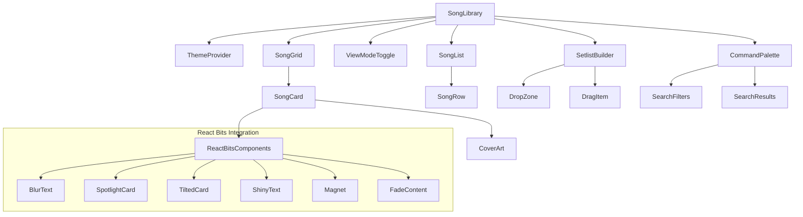
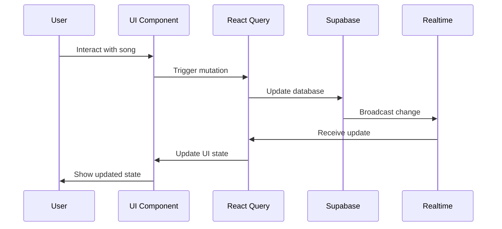

# Song Library UI Revamp - Design Document

## Overview

The Song Library UI Revamp transforms Vestry's existing basic song management system into a premium music application comparable to Spotify and Apple Music. This comprehensive redesign introduces a dual-theme system (Vercel-inspired light mode and Spotify-inspired dark mode), premium UI components with React Bits integration, advanced search capabilities with command palette, chord transposition tools, drag-and-drop setlist building, enhanced data models with rich metadata, and real-time collaboration features.

### Key Design Principles

1. **Premium User Experience**: Every interaction should feel polished and responsive, matching the quality of leading music applications
2. **Dual Theme Excellence**: Both light and dark modes should provide distinct, cohesive aesthetic experiences
3. **Performance First**: Large song collections must load and scroll smoothly with virtual scrolling and lazy loading
4. **Accessibility**: Full keyboard navigation, screen reader support, and WCAG compliance
5. **Real-time Collaboration**: Multiple users can work on setlists simultaneously with conflict resolution
6. **Mobile-First Responsive**: Touch-friendly interactions and optimized layouts for all device sizes

## Architecture

### System Architecture Overview

```mermaid
graph TB
    subgraph "Frontend Layer"
        UI[Song Library UI]
        CP[Command Palette]
        TT[Theme Engine]
        CT[Chord Transposition]
        SB[Setlist Builder]
    end
    
    subgraph "State Management"
        RS[React Query State]
        LS[Local Storage]
        SS[Session Storage]
    end
    
    subgraph "Backend Services"
        SB_API[Supabase Database]
        ST[Supabase Storage]
        RT[Supabase Realtime]
    end
    
    subgraph "External Services"
        RB[React Bits Components]
        FM[Framer Motion]
        DK[@dnd-kit]
        CMDK[cmdk]
    end
    
    UI --> RS
    CP --> RS
    CT --> LS
    SB --> RT
    TT --> LS
    
    RS --> SB_API
    UI --> ST
    
    UI --> RB
    UI --> FM
    SB --> DK
    CP --> CMDK
```

### Component Architecture



## Components and Interfaces

### Core Components

#### 1. SongLibrary (Main Container)
```typescript
interface SongLibraryProps {
  initialView?: 'grid' | 'list';
  enableCollaboration?: boolean;
}

interface SongLibraryState {
  viewMode: 'grid' | 'list';
  searchQuery: string;
  filters: FilterState;
  selectedSongs: string[];
  activeSetlist: string | null;
}
```

#### 2. ThemeProvider
```typescript
interface ThemeContextValue {
  theme: 'light' | 'dark';
  toggleTheme: () => void;
  ambientColors: AmbientColorState;
  setAmbientColors: (colors: AmbientColorState) => void;
}

interface AmbientColorState {
  primary: string;
  secondary: string;
  accent: string;
}
```

#### 3. CommandPalette
```typescript
interface CommandPaletteProps {
  isOpen: boolean;
  onClose: () => void;
  songs: Song[];
  onSongSelect: (song: Song) => void;
}

interface SearchState {
  query: string;
  filters: SearchFilters;
  results: SearchResult[];
  recentSearches: string[];
  popularSongs: Song[];
}

interface SearchFilters {
  keys: string[];
  bpmRange: [number, number];
  timeSignatures: string[];
  tags: string[];
}
```

#### 4. SongCard (Grid View)
```typescript
interface SongCardProps {
  song: Song;
  isSelected: boolean;
  onSelect: (song: Song) => void;
  onEdit: (song: Song) => void;
  onAddToSetlist: (song: Song) => void;
  variant: 'spotlight' | 'tilted' | 'standard';
}
```

#### 5. ChordTranspositionTool
```typescript
interface ChordTranspositionProps {
  originalChords: string;
  originalKey: string;
  onTranspose: (semitones: number) => void;
  userPreferences: TranspositionPreferences;
}

interface TranspositionState {
  semitones: number; // -6 to +6
  transposedChords: string;
  transposedKey: string;
}
```

#### 6. SetlistBuilder
```typescript
interface SetlistBuilderProps {
  setlist: Setlist;
  availableSongs: Song[];
  onUpdateSetlist: (setlist: Setlist) => void;
  collaborators: User[];
  isRealTimeEnabled: boolean;
}

interface SetlistItem {
  id: string;
  songId: string;
  position: number;
  keyOverride?: string;
  notes?: string;
  duration?: number;
}
```

### Data Flow Architecture



## Data Models

### Enhanced Song Schema

```sql
-- Enhanced songs table with new fields for UI revamp
ALTER TABLE songs ADD COLUMN IF NOT EXISTS bpm integer;
ALTER TABLE songs ADD COLUMN IF NOT EXISTS time_signature varchar(10);
ALTER TABLE songs ADD COLUMN IF NOT EXISTS cover_art_url text;
ALTER TABLE songs ADD COLUMN IF NOT EXISTS cover_art_colors jsonb;
ALTER TABLE songs ADD COLUMN IF NOT EXISTS duration_seconds integer;
ALTER TABLE songs ADD COLUMN IF NOT EXISTS usage_count integer DEFAULT 0;
ALTER TABLE songs ADD COLUMN IF NOT EXISTS last_played_at timestamptz;
ALTER TABLE songs ADD COLUMN IF NOT EXISTS custom_fields jsonb DEFAULT '{}';
ALTER TABLE songs ADD COLUMN IF NOT EXISTS is_trending boolean DEFAULT false;

-- Add indexes for performance
CREATE INDEX IF NOT EXISTS idx_songs_bpm ON songs(bpm);
CREATE INDEX IF NOT EXISTS idx_songs_usage_count ON songs(usage_count DESC);
CREATE INDEX IF NOT EXISTS idx_songs_last_played ON songs(last_played_at DESC);
CREATE INDEX IF NOT EXISTS idx_songs_tags ON songs USING GIN(tags);
```

### TypeScript Interfaces

```typescript
interface Song {
  id: string;
  tenant_id: string;
  title: string;
  artist?: string;
  lyrics?: string;
  chords?: string;
  key?: string;
  bpm?: number;
  time_signature?: string;
  tags: string[];
  cover_art_url?: string;
  cover_art_colors?: CoverArtColors;
  chord_sheet_path?: string;
  video_url?: string;
  duration_seconds?: number;
  usage_count: number;
  last_played_at?: string;
  custom_fields: Record<string, any>;
  is_trending: boolean;
  created_at: string;
  updated_at: string;
}

interface CoverArtColors {
  primary: string;
  secondary: string;
  accent: string;
  dominant: string[];
}

interface Setlist {
  id: string;
  tenant_id: string;
  name: string;
  service_date?: string;
  notes?: string;
  items: SetlistItem[];
  total_duration?: number;
  collaborators: string[];
  created_at: string;
  updated_at: string;
}

interface UserPreferences {
  id: string;
  user_id: string;
  tenant_id: string;
  theme: 'light' | 'dark';
  view_mode: 'grid' | 'list';
  transposition_preferences: Record<string, number>; // songId -> semitones
  filter_presets: FilterPreset[];
  recent_searches: string[];
}

interface FilterPreset {
  id: string;
  name: string;
  filters: SearchFilters;
}
```

### Usage Analytics Schema

```sql
-- Usage analytics table for tracking song performance
CREATE TABLE IF NOT EXISTS song_usage_analytics (
  id varchar PRIMARY KEY DEFAULT gen_random_uuid()::text,
  tenant_id varchar NOT NULL REFERENCES tenants(id) ON DELETE CASCADE,
  song_id varchar NOT NULL REFERENCES songs(id) ON DELETE CASCADE,
  service_type varchar,
  used_at timestamptz DEFAULT now(),
  setlist_id varchar REFERENCES set_lists(id) ON DELETE SET NULL,
  key_used varchar,
  duration_played integer,
  created_at timestamptz DEFAULT now()
);

CREATE INDEX IF NOT EXISTS idx_song_usage_tenant_song ON song_usage_analytics(tenant_id, song_id);
CREATE INDEX IF NOT EXISTS idx_song_usage_date ON song_usage_analytics(used_at DESC);
```

## Correctness Properties

*A property is a characteristic or behavior that should hold true across all valid executions of a system-essentially, a formal statement about what the system should do. Properties serve as the bridge between human-readable specifications and machine-verifiable correctness guarantees.*

### Property 1: Theme Persistence

*For any* theme selection (light or dark), the system SHALL persist the selection across browser sessions and restore it correctly on subsequent visits.

**Validates: Requirements 1.4**

### Property 2: Keyboard Shortcut Activation

*For any* keyboard shortcut combination (⌘K on macOS, Ctrl+K on Windows/Linux), the command palette SHALL activate when the correct keys are pressed simultaneously.

**Validates: Requirements 3.1**

### Property 3: Fuzzy Search Accuracy

*For any* search query, the fuzzy search SHALL return songs that contain the query text in title, artist, lyrics, or tags fields, with results ranked by relevance.

**Validates: Requirements 3.2**

### Property 4: Real-time Search Results

*For any* search input change, the system SHALL update search results within 100ms without requiring explicit search submission.

**Validates: Requirements 3.3**

### Property 5: Multi-criteria Filtering

*For any* combination of search filters (key, BPM range, time signature, tags), the system SHALL return only songs that match ALL specified criteria.

**Validates: Requirements 3.4**

### Property 6: Default Content Display

*For any* empty search state, the command palette SHALL display recent searches and popular songs based on usage analytics.

**Validates: Requirements 3.5**

### Property 7: Navigation from Search

*For any* search result selection, the system SHALL navigate to the correct song detail view or perform the specified action.

**Validates: Requirements 3.6**

### Property 8: Card Data Completeness

*For any* song displayed in grid view, the card SHALL contain all available metadata fields (cover art, title, artist, key, BPM) when present in the song data.

**Validates: Requirements 4.3**

### Property 9: View Mode Persistence

*For any* user's view mode selection (grid or list), the system SHALL persist the preference and restore it on subsequent sessions.

**Validates: Requirements 4.5**

### Property 10: Scroll Position Preservation

*For any* view mode switch, the system SHALL maintain the user's approximate scroll position in the song collection.

**Validates: Requirements 4.7**

### Property 11: Cover Art Upload Association

*For any* cover art file upload, the system SHALL correctly associate the image with the target song and store the file reference.

**Validates: Requirements 5.1**

### Property 12: Gradient Generation Consistency

*For any* song without cover art, the system SHALL generate a consistent gradient pattern based on the song title and artist that remains the same across sessions.

**Validates: Requirements 5.2, 5.5**

### Property 13: Color Extraction Accuracy

*For any* uploaded cover art image, the system SHALL extract and store dominant color information that can be used for ambient effects.

**Validates: Requirements 5.3**

### Property 14: Image Optimization Processing

*For any* uploaded cover art, the system SHALL convert to WebP format and generate multiple sizes for responsive display.

**Validates: Requirements 5.6**

### Property 15: Fallback Gradient Display

*For any* cover art loading failure, the system SHALL display a fallback gradient instead of broken image indicators.

**Validates: Requirements 5.7**

### Property 16: Transposition Range Validation

*For any* transposition slider input, the system SHALL accept values from -6 to +6 semitones and reject values outside this range.

**Validates: Requirements 6.1**

### Property 17: Real-time Chord Updates

*For any* transposition slider movement, the chord display SHALL update immediately to show the transposed chords in the new key.

**Validates: Requirements 6.2**

### Property 18: Chord Format Preservation

*For any* chord transposition operation, the original formatting, spacing, and structure of the chord chart SHALL be preserved.

**Validates: Requirements 6.3**

### Property 19: Complex Chord Handling

*For any* complex chord notation (sus, add, maj7, etc.), the transposition engine SHALL correctly parse and transpose the chord while maintaining its complexity.

**Validates: Requirements 6.4**

### Property 20: Key Display Accuracy

*For any* transposition operation, both the original key and transposed key SHALL be prominently displayed and correctly calculated.

**Validates: Requirements 6.5**

### Property 21: Slider Reset Functionality

*For any* double-click on the transposition slider center, the system SHALL reset the transposition to 0 semitones (original key).

**Validates: Requirements 6.6**

### Property 22: Transposition Preference Persistence

*For any* user's transposition setting for a specific song, the system SHALL save and restore the preference in future sessions.

**Validates: Requirements 6.7**

### Property 23: Drag-and-Drop Data Integrity

*For any* drag-and-drop operation in setlist building, the underlying data structure SHALL accurately reflect the visual changes made through the interface.

**Validates: Requirements 7.1, 7.2, 7.3**

### Property 24: Service Duration Calculation

*For any* setlist with songs that have duration data, the total service duration SHALL equal the sum of individual song durations.

**Validates: Requirements 7.4**

### Property 25: Key Transition Analysis

*For any* setlist with consecutive songs that have key information, the system SHALL correctly identify and display key transitions between adjacent songs.

**Validates: Requirements 7.5**

### Property 26: Multiple Setlist Support

*For any* service, the system SHALL support creation and management of multiple associated setlists (pre-service, worship, etc.).

**Validates: Requirements 7.6**

### Property 27: Auto-save Functionality

*For any* setlist modification, the system SHALL automatically save changes without requiring explicit user save actions.

**Validates: Requirements 7.8**

### Property 28: Metadata Storage Completeness

*For any* song with BPM, time signature, tags, usage data, cover art, duration, or custom fields, the system SHALL store and retrieve all provided metadata accurately.

**Validates: Requirements 8.1, 8.2, 8.3, 8.4, 8.5, 8.6, 8.7, 8.8**

### Property 29: Usage Analytics Accuracy

*For any* song usage event in a service, the analytics system SHALL correctly increment usage count, update last played date, and track service-specific usage patterns.

**Validates: Requirements 9.1, 9.2, 9.3, 9.4, 9.5, 9.6, 9.7**

### Property 30: Touch Interface Compatibility

*For any* touch-based interaction (command palette, transposition slider, drag-and-drop), the system SHALL respond correctly to touch events and gestures.

**Validates: Requirements 10.3, 10.4, 10.5**

### Property 31: Adaptive Image Loading

*For any* device with bandwidth constraints, the system SHALL serve appropriately sized images based on device capabilities and network conditions.

**Validates: Requirements 10.6**

### Property 32: Gesture Navigation

*For any* swipe gesture on mobile devices, the system SHALL trigger the appropriate navigation action (next/previous song, view switching, etc.).

**Validates: Requirements 10.7**

### Property 33: Virtual Scrolling Performance

*For any* song collection size, the virtual scrolling system SHALL maintain smooth performance by rendering only visible items plus a buffer.

**Validates: Requirements 11.1**

### Property 34: Lazy Loading Behavior

*For any* cover art image, the system SHALL load the image only when it enters or approaches the viewport.

**Validates: Requirements 11.2**

### Property 35: Caching Strategy Effectiveness

*For any* frequently accessed song, the system SHALL store it in browser cache and serve subsequent requests from cache when available.

**Validates: Requirements 11.3**

### Property 36: Progressive Loading Priority

*For any* song data request, essential metadata SHALL load before supplementary details, ensuring core functionality is available quickly.

**Validates: Requirements 11.4, 11.5**

### Property 37: Keyboard Navigation Completeness

*For any* interactive element in the interface, the system SHALL provide keyboard navigation paths that allow full operation without mouse input.

**Validates: Requirements 12.1, 12.3, 12.4**

### Property 38: Accessibility Markup Compliance

*For any* UI element, appropriate ARIA labels, roles, and properties SHALL be present to support screen reader navigation.

**Validates: Requirements 12.2**

### Property 39: Focus Management Consistency

*For any* view transition or modal operation, the system SHALL maintain logical focus order and return focus appropriately.

**Validates: Requirements 12.5**

### Property 40: High Contrast Mode Support

*For any* user enabling high contrast mode, the system SHALL apply appropriate color schemes that meet accessibility contrast requirements.

**Validates: Requirements 12.6**

### Property 41: Screen Reader Announcements

*For any* dynamic content change (search results, setlist updates, etc.), the system SHALL announce changes to screen readers appropriately.

**Validates: Requirements 12.7**

### Property 42: Import Data Processing

*For any* valid CSV or ChordPro file import, the system SHALL correctly parse the data and create corresponding song records with proper validation.

**Validates: Requirements 13.1, 13.2, 13.5**

### Property 43: Export Format Accuracy

*For any* export operation (PDF setlists, CSV song data), the generated file SHALL contain complete and accurately formatted data.

**Validates: Requirements 13.3, 13.4**

### Property 44: Batch Operation Integrity

*For any* batch operation on multiple songs, the system SHALL process all items consistently and report any failures clearly.

**Validates: Requirements 13.6, 13.7**

### Property 45: Real-time Synchronization

*For any* setlist change made by one user, all other connected users SHALL receive the update within 2 seconds through real-time synchronization.

**Validates: Requirements 14.1**

### Property 46: Presence Tracking Accuracy

*For any* user viewing or editing a setlist, their presence SHALL be accurately tracked and displayed to other users.

**Validates: Requirements 14.2**

### Property 47: Conflict Resolution Effectiveness

*For any* conflicting edit attempt, the system SHALL detect the conflict and provide appropriate resolution mechanisms using optimistic locking.

**Validates: Requirements 14.3**

### Property 48: Change History Integrity

*For any* setlist modification, the system SHALL maintain accurate change history that supports reliable undo/redo operations.

**Validates: Requirements 14.5**

### Property 49: Conflict Notification System

*For any* edit conflict, users SHALL be notified promptly with clear resolution options and conflict details.

**Validates: Requirements 14.6**

### Property 50: Cross-tab Synchronization

*For any* user with multiple browser tabs open, changes in one tab SHALL be reflected in other tabs within 1 second.

**Validates: Requirements 14.7**

### Property 51: Advanced Filtering Logic

*For any* combination of multiple filter criteria with AND/OR logic, the system SHALL return results that correctly match the specified boolean conditions.

**Validates: Requirements 15.1, 15.2**

### Property 52: Sorting Accuracy

*For any* sort criterion (title, artist, key, BPM, usage frequency, date added), the song list SHALL be ordered correctly according to the selected field.

**Validates: Requirements 15.3**

### Property 53: Filter Preset Management

*For any* saved filter preset, the system SHALL store the complete filter configuration and restore it accurately when selected.

**Validates: Requirements 15.4**

### Property 54: Quick Filter Functionality

*For any* quick filter button (fast songs, slow songs, etc.), the system SHALL apply the predefined filter criteria correctly.

**Validates: Requirements 15.5**

### Property 55: Filter State Management

*For any* filter operation, the system SHALL provide accurate result counts and allow selective clearing of filters while preserving search terms.

**Validates: Requirements 15.6, 15.7**

## Error Handling

### Error Categories and Strategies

#### 1. Network and Connectivity Errors
- **Offline Mode**: Cache critical data for offline access
- **Connection Loss**: Queue operations and sync when reconnected
- **Timeout Handling**: Retry with exponential backoff
- **Real-time Disconnection**: Graceful degradation with reconnection attempts

#### 2. Data Validation Errors
- **Import Validation**: Clear error messages with line-by-line feedback
- **Form Validation**: Real-time validation with helpful error messages
- **File Upload Errors**: Progress indicators and retry mechanisms
- **Chord Parsing Errors**: Fallback to original format with error highlighting

#### 3. Performance and Resource Errors
- **Memory Limits**: Virtual scrolling and lazy loading to prevent memory issues
- **Large File Handling**: Progressive upload with chunking
- **Image Processing Failures**: Fallback to default gradients
- **Cache Overflow**: Intelligent cache eviction strategies

#### 4. Collaboration Conflicts
- **Edit Conflicts**: Visual conflict resolution interface
- **Version Mismatches**: Automatic merge with manual resolution options
- **Presence Errors**: Graceful handling of user disconnections
- **Lock Timeouts**: Automatic lock release with user notification

#### 5. Accessibility Errors
- **Screen Reader Issues**: Fallback text for complex interactions
- **Keyboard Navigation Failures**: Alternative navigation paths
- **Focus Management Errors**: Focus restoration mechanisms
- **Color Contrast Issues**: High contrast mode enforcement

### Error Recovery Mechanisms

```typescript
interface ErrorBoundaryState {
  hasError: boolean;
  errorType: 'network' | 'validation' | 'performance' | 'collaboration' | 'accessibility';
  errorMessage: string;
  retryCount: number;
  canRecover: boolean;
}

interface RetryStrategy {
  maxRetries: number;
  backoffMultiplier: number;
  baseDelay: number;
  shouldRetry: (error: Error) => boolean;
}
```

## Testing Strategy

### Dual Testing Approach

The Song Library UI Revamp requires both unit tests for specific functionality and property-based tests for universal behaviors across the system.

#### Unit Testing Focus Areas

1. **Component Integration Tests**
   - React Bits component integration
   - Theme switching functionality
   - Drag-and-drop interactions
   - Command palette keyboard shortcuts

2. **Edge Cases and Error Conditions**
   - Invalid chord notation handling
   - Network failure scenarios
   - File upload edge cases
   - Collaboration conflict resolution

3. **Accessibility Testing**
   - Screen reader compatibility
   - Keyboard navigation paths
   - Focus management
   - ARIA attribute presence

#### Property-Based Testing Configuration

**Library**: fast-check (already installed)
**Test Configuration**: Minimum 100 iterations per property test
**Tagging Format**: `Feature: song-library-ui-revamp, Property {number}: {property_text}`

**Property Test Categories**:

1. **Data Persistence Properties** (Properties 1, 9, 22, 28)
   - Theme and preference persistence
   - Transposition settings storage
   - Metadata completeness

2. **Search and Filtering Properties** (Properties 2-7, 51-55)
   - Keyboard shortcut activation
   - Fuzzy search accuracy
   - Multi-criteria filtering logic

3. **Real-time Collaboration Properties** (Properties 45-50)
   - Synchronization accuracy
   - Conflict resolution
   - Cross-tab communication

4. **Performance Properties** (Properties 33-36)
   - Virtual scrolling behavior
   - Lazy loading effectiveness
   - Caching strategies

5. **Accessibility Properties** (Properties 37-41)
   - Keyboard navigation completeness
   - Screen reader support
   - Focus management

**Example Property Test Implementation**:

```typescript
// Feature: song-library-ui-revamp, Property 3: Fuzzy Search Accuracy
test('fuzzy search returns relevant songs for any query', () => {
  fc.assert(fc.property(
    fc.string({ minLength: 1, maxLength: 50 }),
    fc.array(songGenerator, { minLength: 10, maxLength: 100 }),
    (query, songs) => {
      const results = fuzzySearch(query, songs);
      
      // All results should contain the query in searchable fields
      results.forEach(result => {
        const searchableText = [
          result.title,
          result.artist,
          result.lyrics,
          ...result.tags
        ].join(' ').toLowerCase();
        
        expect(searchableText).toContain(query.toLowerCase());
      });
      
      // Results should be ranked by relevance
      for (let i = 1; i < results.length; i++) {
        expect(results[i-1].relevanceScore).toBeGreaterThanOrEqual(
          results[i].relevanceScore
        );
      }
    }
  ));
});
```

#### Integration Testing

1. **End-to-End Workflows**
   - Complete setlist creation and management
   - Song import and export processes
   - Collaborative editing scenarios
   - Theme switching with data persistence

2. **Performance Testing**
   - Large dataset handling (1000+ songs)
   - Concurrent user scenarios
   - Mobile device performance
   - Network condition variations

3. **Cross-Browser Testing**
   - Keyboard shortcut compatibility
   - Touch interaction support
   - Theme rendering consistency
   - Real-time synchronization reliability

#### Mock Strategies

1. **Supabase Mocking**: Mock database operations for unit tests
2. **File Upload Mocking**: Simulate image processing and storage
3. **Real-time Mocking**: Mock WebSocket connections for collaboration tests
4. **External Service Mocking**: Mock React Bits components for isolated testing

### Test Coverage Requirements

- **Unit Tests**: 90% code coverage minimum
- **Property Tests**: All 55 correctness properties implemented
- **Integration Tests**: Critical user journeys covered
- **Accessibility Tests**: WCAG 2.1 AA compliance verified
- **Performance Tests**: Load time and interaction benchmarks met

The comprehensive testing strategy ensures that the Song Library UI Revamp maintains high quality, performance, and accessibility standards while providing the premium user experience comparable to leading music applications.

## Implementation Architecture

### Technology Stack Integration

#### Core Dependencies (Already Available)
- **React 18.3.1**: Component framework with concurrent features
- **Framer Motion 12.38.0**: Animation engine for premium interactions
- **@dnd-kit**: Drag-and-drop functionality for setlist building
- **cmdk 1.1.1**: Command palette implementation
- **TanStack Query 5.83.0**: State management and caching
- **Supabase 2.99.3**: Backend services and real-time features

#### New Dependencies Required
```json
{
  "react-bits": "^1.0.0",
  "react-window": "^1.8.8",
  "react-window-infinite-loader": "^1.0.9",
  "colorthief": "^2.4.0",
  "music-theory": "^1.0.0",
  "fuse.js": "^7.0.0"
}
```

### File Structure

```
src/
├── pages/media/
│   └── SongLibrary/
│       ├── index.tsx                 # Main container
│       ├── components/
│       │   ├── CommandPalette/
│       │   │   ├── index.tsx
│       │   │   ├── SearchFilters.tsx
│       │   │   └── SearchResults.tsx
│       │   ├── SongGrid/
│       │   │   ├── index.tsx
│       │   │   ├── SongCard.tsx
│       │   │   └── VirtualGrid.tsx
│       │   ├── SongList/
│       │   │   ├── index.tsx
│       │   │   ├── SongRow.tsx
│       │   │   └── VirtualList.tsx
│       │   ├── SetlistBuilder/
│       │   │   ├── index.tsx
│       │   │   ├── DropZone.tsx
│       │   │   ├── DragItem.tsx
│       │   │   └── CollaborationPanel.tsx
│       │   ├── ChordTransposition/
│       │   │   ├── index.tsx
│       │   │   ├── TranspositionSlider.tsx
│       │   │   └── ChordDisplay.tsx
│       │   ├── CoverArt/
│       │   │   ├── index.tsx
│       │   │   ├── ImageUpload.tsx
│       │   │   ├── GradientGenerator.tsx
│       │   │   └── ColorExtractor.tsx
│       │   └── ThemeProvider/
│       │       ├── index.tsx
│       │       ├── ThemeContext.tsx
│       │       └── AmbientColors.tsx
│       ├── hooks/
│       │   ├── useSongs.ts
│       │   ├── useSetlists.ts
│       │   ├── useCommandPalette.ts
│       │   ├── useChordTransposition.ts
│       │   ├── useCollaboration.ts
│       │   ├── useCoverArt.ts
│       │   └── useUsageAnalytics.ts
│       ├── utils/
│       │   ├── chordTransposition.ts
│       │   ├── colorExtraction.ts
│       │   ├── gradientGeneration.ts
│       │   ├── searchEngine.ts
│       │   └── musicTheory.ts
│       └── types/
│           ├── song.ts
│           ├── setlist.ts
│           ├── theme.ts
│           └── collaboration.ts
```

### Database Migration Strategy

#### Phase 1: Schema Extensions
```sql
-- Add new columns to existing songs table
ALTER TABLE songs 
ADD COLUMN IF NOT EXISTS bpm integer,
ADD COLUMN IF NOT EXISTS time_signature varchar(10),
ADD COLUMN IF NOT EXISTS cover_art_url text,
ADD COLUMN IF NOT EXISTS cover_art_colors jsonb,
ADD COLUMN IF NOT EXISTS duration_seconds integer,
ADD COLUMN IF NOT EXISTS usage_count integer DEFAULT 0,
ADD COLUMN IF NOT EXISTS last_played_at timestamptz,
ADD COLUMN IF NOT EXISTS custom_fields jsonb DEFAULT '{}',
ADD COLUMN IF NOT EXISTS is_trending boolean DEFAULT false;

-- Create indexes for performance
CREATE INDEX CONCURRENTLY IF NOT EXISTS idx_songs_bpm ON songs(bpm);
CREATE INDEX CONCURRENTLY IF NOT EXISTS idx_songs_usage_count ON songs(usage_count DESC);
CREATE INDEX CONCURRENTLY IF NOT EXISTS idx_songs_last_played ON songs(last_played_at DESC);
CREATE INDEX CONCURRENTLY IF NOT EXISTS idx_songs_tags_gin ON songs USING GIN(tags);
CREATE INDEX CONCURRENTLY IF NOT EXISTS idx_songs_cover_colors ON songs USING GIN(cover_art_colors);
```

#### Phase 2: New Tables
```sql
-- User preferences for theme and view settings
CREATE TABLE IF NOT EXISTS user_song_preferences (
  id varchar PRIMARY KEY DEFAULT gen_random_uuid()::text,
  user_id varchar NOT NULL REFERENCES users(id) ON DELETE CASCADE,
  tenant_id varchar NOT NULL REFERENCES tenants(id) ON DELETE CASCADE,
  theme varchar(10) DEFAULT 'light' CHECK (theme IN ('light', 'dark')),
  view_mode varchar(10) DEFAULT 'grid' CHECK (view_mode IN ('grid', 'list')),
  transposition_preferences jsonb DEFAULT '{}',
  filter_presets jsonb DEFAULT '[]',
  recent_searches text[] DEFAULT '{}',
  created_at timestamptz DEFAULT now(),
  updated_at timestamptz DEFAULT now(),
  UNIQUE(user_id, tenant_id)
);

-- Usage analytics for song performance tracking
CREATE TABLE IF NOT EXISTS song_usage_analytics (
  id varchar PRIMARY KEY DEFAULT gen_random_uuid()::text,
  tenant_id varchar NOT NULL REFERENCES tenants(id) ON DELETE CASCADE,
  song_id varchar NOT NULL REFERENCES songs(id) ON DELETE CASCADE,
  service_type varchar,
  used_at timestamptz DEFAULT now(),
  setlist_id varchar REFERENCES set_lists(id) ON DELETE SET NULL,
  key_used varchar,
  duration_played integer,
  user_id varchar REFERENCES users(id) ON DELETE SET NULL,
  created_at timestamptz DEFAULT now()
);

-- Collaboration tracking for real-time editing
CREATE TABLE IF NOT EXISTS setlist_collaborations (
  id varchar PRIMARY KEY DEFAULT gen_random_uuid()::text,
  setlist_id varchar NOT NULL REFERENCES set_lists(id) ON DELETE CASCADE,
  user_id varchar NOT NULL REFERENCES users(id) ON DELETE CASCADE,
  is_active boolean DEFAULT true,
  last_seen_at timestamptz DEFAULT now(),
  cursor_position jsonb,
  created_at timestamptz DEFAULT now(),
  UNIQUE(setlist_id, user_id)
);

-- Change history for undo/redo functionality
CREATE TABLE IF NOT EXISTS setlist_change_history (
  id varchar PRIMARY KEY DEFAULT gen_random_uuid()::text,
  setlist_id varchar NOT NULL REFERENCES set_lists(id) ON DELETE CASCADE,
  user_id varchar NOT NULL REFERENCES users(id) ON DELETE CASCADE,
  change_type varchar NOT NULL,
  change_data jsonb NOT NULL,
  previous_state jsonb,
  created_at timestamptz DEFAULT now()
);
```

#### Phase 3: RLS Policies
```sql
-- User preferences policies
ALTER TABLE user_song_preferences ENABLE ROW LEVEL SECURITY;
CREATE POLICY user_song_preferences_isolation ON user_song_preferences
  FOR ALL USING (
    tenant_id = get_my_tenant_id() AND 
    user_id = auth.uid()::text
  );

-- Usage analytics policies
ALTER TABLE song_usage_analytics ENABLE ROW LEVEL SECURITY;
CREATE POLICY song_usage_analytics_tenant_isolation ON song_usage_analytics
  FOR ALL USING (tenant_id = get_my_tenant_id());

-- Collaboration policies
ALTER TABLE setlist_collaborations ENABLE ROW LEVEL SECURITY;
CREATE POLICY setlist_collaborations_tenant_isolation ON setlist_collaborations
  FOR ALL USING (
    setlist_id IN (
      SELECT id FROM set_lists WHERE tenant_id = get_my_tenant_id()
    )
  );

-- Change history policies
ALTER TABLE setlist_change_history ENABLE ROW LEVEL SECURITY;
CREATE POLICY setlist_change_history_tenant_isolation ON setlist_change_history
  FOR ALL USING (
    setlist_id IN (
      SELECT id FROM set_lists WHERE tenant_id = get_my_tenant_id()
    )
  );
```

### API Endpoints and Data Contracts

#### Enhanced Song Operations
```typescript
// GET /api/songs - Enhanced with new fields
interface GetSongsResponse {
  songs: Song[];
  total: number;
  trending: Song[];
  recent: Song[];
}

// POST /api/songs/search - Advanced search
interface SearchSongsRequest {
  query?: string;
  filters: {
    keys?: string[];
    bpmRange?: [number, number];
    timeSignatures?: string[];
    tags?: string[];
    hasLyrics?: boolean;
    hasChords?: boolean;
    hasCoverArt?: boolean;
  };
  sort?: {
    field: 'title' | 'artist' | 'usage_count' | 'last_played_at' | 'created_at';
    direction: 'asc' | 'desc';
  };
  pagination: {
    offset: number;
    limit: number;
  };
}

// POST /api/songs/upload-cover-art
interface UploadCoverArtRequest {
  songId: string;
  file: File;
}

interface UploadCoverArtResponse {
  coverArtUrl: string;
  colors: CoverArtColors;
  optimizedSizes: {
    thumbnail: string;
    small: string;
    medium: string;
    large: string;
  };
}
```

#### Collaboration Endpoints
```typescript
// WebSocket Events for Real-time Collaboration
interface CollaborationEvents {
  'setlist:join': { setlistId: string; user: User };
  'setlist:leave': { setlistId: string; userId: string };
  'setlist:change': { setlistId: string; change: SetlistChange; user: User };
  'setlist:cursor': { setlistId: string; userId: string; position: CursorPosition };
  'setlist:conflict': { setlistId: string; conflict: EditConflict };
}

// POST /api/setlists/:id/collaborate
interface JoinCollaborationRequest {
  setlistId: string;
}

interface JoinCollaborationResponse {
  collaborators: User[];
  currentState: Setlist;
  changeHistory: SetlistChange[];
}
```

#### Analytics Endpoints
```typescript
// GET /api/analytics/songs/usage
interface SongUsageAnalyticsResponse {
  totalUsage: number;
  trendingPeriod: 'week' | 'month' | 'year';
  topSongs: Array<{
    song: Song;
    usageCount: number;
    lastUsed: string;
    trend: 'up' | 'down' | 'stable';
  }>;
  unusedSongs: Song[];
  usageByServiceType: Record<string, number>;
}

// POST /api/analytics/songs/:id/track-usage
interface TrackUsageRequest {
  songId: string;
  serviceType?: string;
  setlistId?: string;
  keyUsed?: string;
  durationPlayed?: number;
}
```

### Performance Optimization Strategies

#### 1. Virtual Scrolling Implementation
```typescript
// Virtual grid for large song collections
const VirtualSongGrid = ({ songs, itemHeight = 280, itemWidth = 240 }) => {
  const containerRef = useRef<HTMLDivElement>(null);
  const [visibleRange, setVisibleRange] = useState({ start: 0, end: 20 });
  
  const itemsPerRow = Math.floor(containerWidth / itemWidth);
  const totalRows = Math.ceil(songs.length / itemsPerRow);
  
  // Only render visible items plus buffer
  const visibleSongs = songs.slice(
    visibleRange.start * itemsPerRow,
    (visibleRange.end + 1) * itemsPerRow
  );
  
  return (
    <div 
      ref={containerRef}
      style={{ height: totalRows * itemHeight }}
      onScroll={handleScroll}
    >
      {visibleSongs.map((song, index) => (
        <SongCard key={song.id} song={song} />
      ))}
    </div>
  );
};
```

#### 2. Lazy Loading Strategy
```typescript
// Intersection Observer for cover art lazy loading
const useLazyImage = (src: string) => {
  const [imageSrc, setImageSrc] = useState<string | null>(null);
  const [isLoaded, setIsLoaded] = useState(false);
  const imgRef = useRef<HTMLImageElement>(null);
  
  useEffect(() => {
    const observer = new IntersectionObserver(
      ([entry]) => {
        if (entry.isIntersecting && !imageSrc) {
          setImageSrc(src);
          observer.disconnect();
        }
      },
      { rootMargin: '50px' }
    );
    
    if (imgRef.current) {
      observer.observe(imgRef.current);
    }
    
    return () => observer.disconnect();
  }, [src, imageSrc]);
  
  return { imgRef, imageSrc, isLoaded };
};
```

#### 3. Caching Strategy
```typescript
// Multi-level caching with React Query and browser storage
const useSongsWithCaching = (tenantId: string) => {
  return useQuery({
    queryKey: ['songs', tenantId],
    queryFn: async () => {
      // Check browser cache first
      const cached = localStorage.getItem(`songs-${tenantId}`);
      if (cached) {
        const { data, timestamp } = JSON.parse(cached);
        if (Date.now() - timestamp < 5 * 60 * 1000) { // 5 minutes
          return data;
        }
      }
      
      // Fetch from server
      const songs = await fetchSongs(tenantId);
      
      // Cache in browser storage
      localStorage.setItem(`songs-${tenantId}`, JSON.stringify({
        data: songs,
        timestamp: Date.now()
      }));
      
      return songs;
    },
    staleTime: 5 * 60 * 1000, // 5 minutes
    cacheTime: 30 * 60 * 1000, // 30 minutes
  });
};
```

### Security and Access Control

#### 1. Row Level Security (RLS)
All new tables implement tenant isolation through RLS policies that ensure users can only access data belonging to their church (tenant).

#### 2. File Upload Security
```typescript
// Secure cover art upload with validation
const uploadCoverArt = async (file: File, songId: string) => {
  // Validate file type and size
  if (!file.type.startsWith('image/')) {
    throw new Error('Only image files are allowed');
  }
  
  if (file.size > 5 * 1024 * 1024) { // 5MB limit
    throw new Error('File size must be less than 5MB');
  }
  
  // Generate secure file path
  const fileExt = file.name.split('.').pop();
  const fileName = `${songId}-${Date.now()}.${fileExt}`;
  const filePath = `${tenantId}/cover-art/${fileName}`;
  
  // Upload to Supabase Storage with RLS
  const { data, error } = await supabase.storage
    .from('song-cover-art')
    .upload(filePath, file, {
      cacheControl: '3600',
      upsert: false
    });
    
  if (error) throw error;
  return data;
};
```

#### 3. Real-time Security
```typescript
// Secure WebSocket connections with authentication
const useCollaboration = (setlistId: string) => {
  const { user } = useAuth();
  
  useEffect(() => {
    if (!user) return;
    
    const channel = supabase
      .channel(`setlist:${setlistId}`)
      .on('postgres_changes', {
        event: '*',
        schema: 'public',
        table: 'set_list_songs',
        filter: `set_list_id=eq.${setlistId}`
      }, handleSetlistChange)
      .subscribe((status) => {
        if (status === 'SUBSCRIBED') {
          // Announce presence
          channel.track({
            user_id: user.id,
            user_name: user.name,
            online_at: new Date().toISOString()
          });
        }
      });
      
    return () => {
      supabase.removeChannel(channel);
    };
  }, [setlistId, user]);
};
```

### Mobile Responsiveness Design

#### 1. Responsive Breakpoints
```css
/* Tailwind custom breakpoints for song library */
@media (max-width: 640px) {
  /* Mobile: Single column grid, touch-friendly controls */
  .song-grid {
    grid-template-columns: 1fr;
    gap: 1rem;
  }
  
  .command-palette {
    position: fixed;
    top: 0;
    left: 0;
    right: 0;
    bottom: 0;
    border-radius: 0;
  }
}

@media (min-width: 641px) and (max-width: 1024px) {
  /* Tablet: Two column grid, hybrid touch/mouse */
  .song-grid {
    grid-template-columns: repeat(2, 1fr);
    gap: 1.5rem;
  }
}

@media (min-width: 1025px) {
  /* Desktop: Multi-column grid, mouse-optimized */
  .song-grid {
    grid-template-columns: repeat(auto-fill, minmax(240px, 1fr));
    gap: 2rem;
  }
}
```

#### 2. Touch Interactions
```typescript
// Touch-friendly drag and drop for mobile
const useTouchDragAndDrop = () => {
  const [dragState, setDragState] = useState<DragState | null>(null);
  
  const handleTouchStart = (e: TouchEvent, item: SetlistItem) => {
    const touch = e.touches[0];
    setDragState({
      item,
      startX: touch.clientX,
      startY: touch.clientY,
      currentX: touch.clientX,
      currentY: touch.clientY
    });
  };
  
  const handleTouchMove = (e: TouchEvent) => {
    if (!dragState) return;
    
    const touch = e.touches[0];
    setDragState(prev => ({
      ...prev!,
      currentX: touch.clientX,
      currentY: touch.clientY
    }));
    
    // Provide haptic feedback
    if ('vibrate' in navigator) {
      navigator.vibrate(10);
    }
  };
  
  return { handleTouchStart, handleTouchMove, dragState };
};
```

This comprehensive design document provides the technical foundation for implementing the Song Library UI Revamp with all the premium features, performance optimizations, and accessibility requirements specified in the requirements document. The architecture supports scalability, maintainability, and the premium user experience comparable to leading music applications like Spotify and Apple Music.