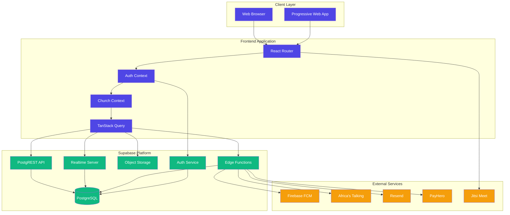
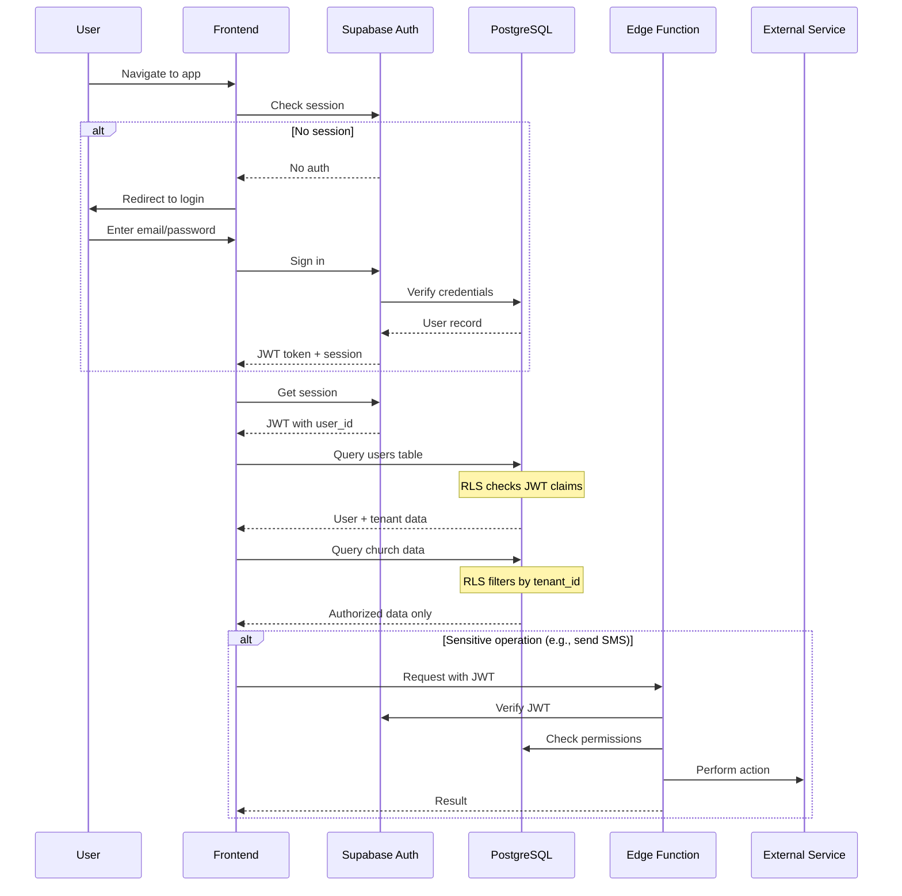
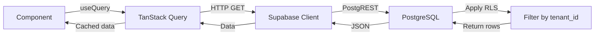
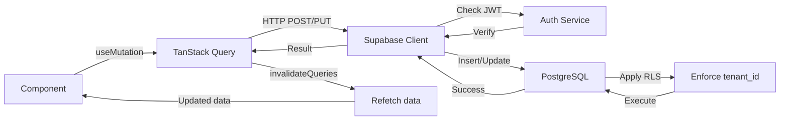
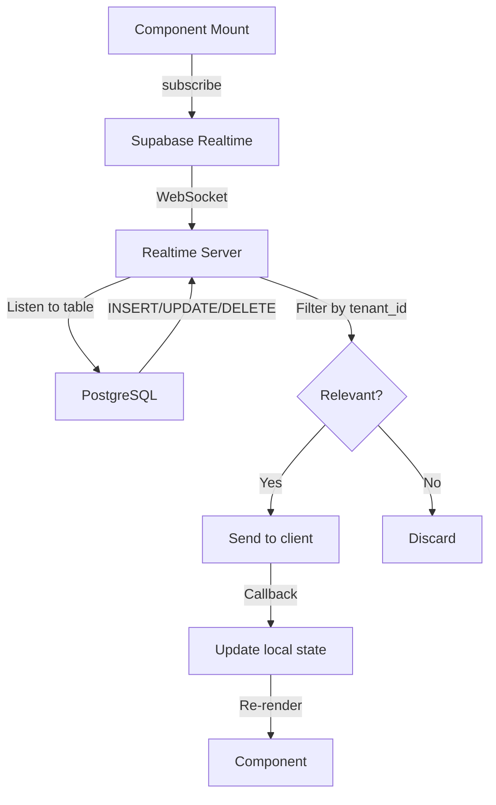

# VestryHub - System Overview

## What is VestryHub?

VestryHub is a comprehensive, multi-tenant Church Management SaaS platform designed to help churches of all sizes manage their operations, communicate with members, track finances, coordinate events, and foster spiritual growth. It's comparable to ChurchSuite and Planning Center Online but built with modern web technologies and designed for flexibility and scalability.

## Tech Stack

### Frontend
- **React 18.3** - UI library
- **TypeScript 5.8** - Type-safe JavaScript
- **Vite 5.4** - Build tool and dev server
- **React Router 6.30** - Client-side routing
- **TanStack Query v5** - Server state management (all data fetching)
- **React Hook Form + Zod** - Form handling and validation
- **Tailwind CSS 3.4** - Utility-first styling
- **shadcn/ui** - Pre-built accessible component library based on Radix UI
- **Framer Motion 12** - Animation library
- **Lucide React** - Icon library
- **Recharts 2.15** - Charts and data visualization
- **date-fns 3.6** - Date formatting and manipulation

### Backend & Infrastructure
- **Supabase** - Backend-as-a-Service platform providing:
  - **PostgreSQL** - Primary database
  - **Row Level Security (RLS)** - Data isolation per tenant
  - **Realtime** - WebSocket-based live updates
  - **Edge Functions** - Serverless Deno functions for server-side logic
  - **Storage** - File uploads and CDN
  - **Auth** - Authentication with magic links, OAuth, and email/password

### Third-Party Integrations
- **Firebase Cloud Messaging (FCM)** - Push notifications
- **PayHero** - Payment processing (M-Pesa, bank transfers)
- **Africa's Talking** - SMS messaging
- **Resend** - Transactional email delivery
- **Jitsi** - Video conferencing for livestreaming
- **Canva** - Design tool integration
- **Sentry** - Error tracking and monitoring
- **PostHog** - Product analytics

### Development Tools
- **Vitest** - Unit testing
- **Playwright** - E2E testing
- **ESLint** - Code linting
- **Bun** - Fast package manager (alternative to npm)

## Multi-Tenant Architecture

VestryHub is designed as a **fully multi-tenant application** where:

- Each church is a **tenant** (stored in the `tenants` table)
- All data is isolated by `tenant_id` column
- Every Supabase query MUST filter by `tenant_id`
- Row Level Security (RLS) policies enforce tenant isolation at the database level
- Users can only access data for their own church/tenant
- Shared infrastructure serves all tenants from a single deployment

### Tenant Isolation Patterns

```typescript
// CORRECT - Always filter by tenant_id
const { data } = await supabase
  .from('members')
  .select('*')
  .eq('tenant_id', tenantId);

// WRONG - Never query without tenant filter
const { data } = await supabase
  .from('members')
  .select('*');
```

## High-Level System Architecture



## Authentication & Authorization Flow



## Data Flow Patterns

### Query Pattern (Read Operations)


### Mutation Pattern (Write Operations)


### Realtime Subscription Pattern


## Key Design Principles

### 1. **No Direct Data Fetching in Components**
- NEVER use `useEffect` + `useState` for data fetching
- ALWAYS use TanStack Query (`useQuery`, `useMutation`)
- Set `staleTime: 300_000` (5 minutes) on all queries

### 2. **Always Use Schema Constants**
- Import `TABLES` and `COLS` from `src/lib/schema.ts`
- NEVER hardcode table or column names as strings
- This protects against typos and makes refactoring safe

### 3. **Tenant Isolation is Sacred**
- Every query MUST filter by `tenant_id` from `useChurch()` context
- Never fetch data across tenants
- RLS policies are the last line of defense

### 4. **Permission Gates Everywhere**
- Use `usePermissions()` hook for feature access checks
- Wrap action buttons with `<PermissionButton>`
- Check `isReadOnly(feature)` before mutations

### 5. **Toast on Every Mutation**
- Success: `toast.success("Action completed")`
- Error: `toast.error("Action failed")`
- Provides user feedback for all state changes

### 6. **Optimistic Updates**
- Use `onMutate` for instant UI updates
- `onError` to rollback on failure
- `onSuccess` to invalidate and refetch affected queries

### 7. **Lazy Loading for Performance**
- Use `React.lazy()` for route-level components
- Lazy load heavy libraries (Recharts, ReactPlayer, etc.)
- Keep initial bundle small

## Project Structure Philosophy

The codebase is organized by **feature modules** rather than technical layers:

```
src/
├── pages/           # Feature-based pages
│   ├── people/      # People management module
│   ├── finance/     # Finance module
│   ├── communications/ # Communications module
│   └── ...
├── components/      # Feature-based components
│   ├── members/     # Member-specific components
│   ├── finance/     # Finance-specific components
│   └── shared/      # Cross-feature shared components
├── contexts/        # Global state (Church, Auth, Member Portal)
├── hooks/           # Reusable hooks (usePermissions, useSubscription)
├── lib/             # Utilities, schema, services
└── integrations/    # Third-party SDKs (Supabase client)
```

This structure makes it easy to:
- Find all code related to a feature in one place
- Understand feature boundaries
- Add or remove features with minimal impact
- Onboard new developers quickly

## Environment Variables

Key environment variables (see `.env.example`):

```bash
# Supabase
VITE_SUPABASE_URL=           # Supabase project URL
VITE_SUPABASE_ANON_KEY=      # Public anon key

# Firebase (Push Notifications)
VITE_FIREBASE_VAPID_KEY=     # FCM VAPID key

# AI Services
VITE_OPENAI_API_KEY=         # OpenAI for AI-powered features

# Integrations
VITE_CANVA_CLIENT_ID=        # Canva integration
VITE_JITSI_DOMAIN=           # Jitsi video conferencing
```

Server-side environment variables are set in Supabase Edge Function secrets.

## Deployment

VestryHub is deployed as:
- **Frontend**: Static site on Vercel/Netlify (Vite build output)
- **Backend**: Supabase managed platform (database + edge functions)
- **CDN**: Supabase Storage for uploaded files

The application is production-ready with:
- Error tracking (Sentry)
- Analytics (PostHog)
- Performance monitoring
- Automated backups (Supabase)
- SSL/HTTPS enforced

## Next Steps

To understand the system in detail, read the documentation in order:

1. **01-folder-structure.md** - Code organization
2. **02-identity-and-data-model.md** - Database schema and relationships
3. **03-church-lifecycle.md** - User journeys and workflows
4. **04-authentication-and-permissions.md** - Security model
5. **05-edge-functions.md** - Server-side operations
6. **06-messaging-system.md** - Communications architecture
7. **07-feature-modules.md** - Feature-by-feature breakdown
8. **08-architectural-decisions.md** - Why we built it this way
9. **09-known-issues.md** - Current limitations and tech debt
