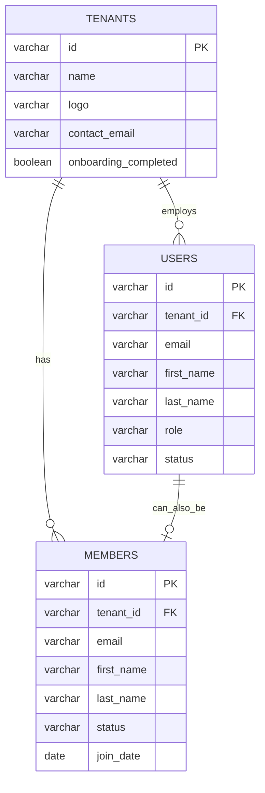
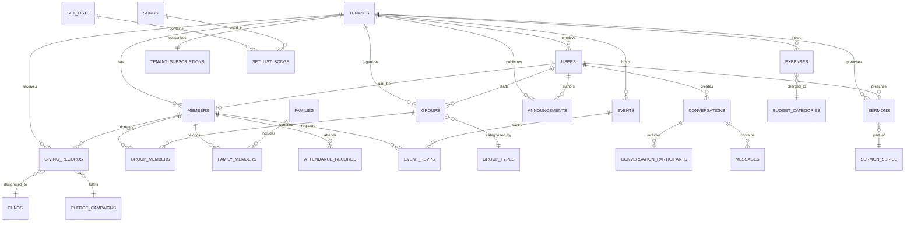

# VestryHub - Identity & Data Model

## The Unified Identity System

VestryHub implements a **unified identity model** where a person can have BOTH a `users` record (for admin/staff access) AND a `members` record (for member portal access), linked by the same ID.

### Identity Relationships



### Key Identity Concepts

**Users Table** (`users`)
- Admin/staff accounts
- Can log into the admin dashboard
- Have roles: `super_admin`, `admin`, `pastor`, `staff`, `member`
- Required for any administrative action

**Members Table** (`members`)
- Church member records
- Can log into member portal (if invited)
- Track attendance, giving, groups, etc.
- May or may not have portal access

**Unified Person**
- When an admin is ALSO a church member, they have BOTH records with the SAME ID
- This allows:
  - Admin access through `users` table
  - Member portal access through `members` table
  - Single identity for giving, attendance, etc.

## Core Tables

### tenants
**Purpose**: Multi-tenant church isolation

| Column | Type | Description |
|--------|------|-------------|
| id | varchar PK | Unique tenant identifier |
| name | varchar | Church name |
| logo | varchar | Logo URL (NOT logo_url) |
| contact_email | varchar | Primary email (NOT email) |
| phone | varchar | Church phone |
| address | text | Physical address |
| city | varchar | City |
| country | varchar | Country code |
| timezone | varchar | Church timezone |
| onboarding_completed | boolean | Setup wizard finished (NOT onboarding_complete) |
| created_at | timestamp | Creation time |

### users
**Purpose**: Admin/staff accounts

| Column | Type | Description |
|--------|------|-------------|
| id | varchar PK | User ID (matches auth.users.id) |
| tenant_id | varchar FK | Links to tenants |
| email | varchar | Login email |
| first_name | varchar | First name |
| last_name | varchar | Last name |
| role | varchar | admin/pastor/staff/member |
| status | varchar | active/inactive |
| avatar_url | varchar | Profile photo |
| created_at | timestamp | Account creation |

### members
**Purpose**: Church member records

| Column | Type | Description |
|--------|------|-------------|
| id | varchar PK | Member ID (can match users.id) |
| tenant_id | varchar FK | Links to tenants |
| first_name | varchar | First name |
| last_name | varchar | Last name |
| email | varchar | Contact email |
| phone | varchar | Phone number |
| gender | varchar | Gender |
| date_of_birth | date | Birthday |
| join_date | date | Membership start |
| status | varchar | active/inactive/visitor |
| avatar_url | varchar | Profile photo |
| created_at | timestamp | Record creation |

## People Management Tables

### groups
Small groups, Bible studies, ministry teams

| Column | Type | Description |
|--------|------|-------------|
| id | varchar PK | Group ID |
| tenant_id | varchar FK | Church |
| name | varchar | Group name |
| description | text | Group purpose |
| group_type_id | varchar FK | Links to group_types |
| leader_id | varchar FK | Leader (users.id) |
| meet_day | varchar | Meeting day |
| meet_time | time | Meeting time |
| location | varchar | Meeting location |
| is_open | boolean | Open to new members |
| status | varchar | active/inactive |

### group_members
**Purpose**: Group membership

| Column | Type | Description |
|--------|------|-------------|
| id | varchar PK | Record ID |
| tenant_id | varchar FK | Church |
| group_id | varchar FK | Links to groups |
| user_id | varchar FK | Member (can be users OR members ID) |
| role | varchar | member/leader/admin |
| joined_at | timestamp | Join date |

### families
**Purpose**: Family relationships

| Column | Type | Description |
|--------|------|-------------|
| id | varchar PK | Family ID |
| tenant_id | varchar FK | Church |
| family_name | varchar | Family surname |
| head_of_household_id | varchar FK | Primary contact |

### family_members
**Purpose**: Family membership

| Column | Type | Description |
|--------|------|-------------|
| id | varchar PK | Record ID |
| tenant_id | varchar FK | Church |
| family_id | varchar FK | Links to families |
| member_id | varchar FK | Links to members |
| relationship | varchar | father/mother/child/etc |

### visitors
**Purpose**: Track first-time visitors

| Column | Type | Description |
|--------|------|-------------|
| id | varchar PK | Visitor ID |
| tenant_id | varchar FK | Church |
| first_name | varchar | First name |
| last_name | varchar | Last name |
| email | varchar | Email |
| phone | varchar | Phone |
| visit_date | date | First visit date |
| source | varchar | How they found us |
| follow_up_status | varchar | contacted/scheduled/completed |
| converted_to_member | boolean | Became member |

## Finance Tables

### giving_records
**Purpose**: Donation tracking (spec said "donations" - WRONG)

| Column | Type | Description |
|--------|------|-------------|
| id | varchar PK | Record ID |
| tenant_id | varchar FK | Church |
| member_id | varchar FK | Donor (nullable for guests) |
| donor_name | varchar | Name if not member |
| amount | numeric | Donation amount |
| given_at | timestamp | Date/time (NOT donation_date) |
| giving_type | varchar | tithe/offering/etc (NOT category) |
| payment_method | varchar | cash/check/online |
| pesapal_transaction_id | varchar | Payment reference |
| fund_id | varchar FK | Designated fund |
| campaign_id | varchar FK | Pledge campaign |
| is_anonymous | boolean | Hide donor name |
| notes | text | Additional notes |
| receipt_number | varchar | Receipt identifier |

### expenses
**Purpose**: Church expense tracking (spec said "church_expenses" - WRONG)

| Column | Type | Description |
|--------|------|-------------|
| id | varchar PK | Expense ID |
| tenant_id | varchar FK | Church |
| amount | numeric | Expense amount |
| expense_date | date | When spent |
| category_id | varchar FK | Budget category |
| vendor | varchar | Who paid |
| description | text | What for |
| receipt_url | varchar | Receipt attachment |
| approved_by | varchar FK | Approver (users.id) |

### budget_categories
**Purpose**: Budget line items (spec said "budget_lines" - WRONG)

| Column | Type | Description |
|--------|------|-------------|
| id | varchar PK | Category ID |
| tenant_id | varchar FK | Church |
| name | varchar | Category name |
| amount | numeric | Budgeted amount |
| period | varchar | monthly/yearly |

## Events & Attendance Tables

### events
**Purpose**: Church events

| Column | Type | Description |
|--------|------|-------------|
| id | varchar PK | Event ID |
| tenant_id | varchar FK | Church |
| title | varchar | Event name (NOT name) |
| description | text | Event details |
| event_date | date | Event date (NOT start_datetime) |
| start_time | time | Start time |
| end_time | time | End time |
| location | varchar | Venue |
| is_published | boolean | Public visibility (NOT status) |
| capacity_limit | integer | Max attendees (NOT capacity) |
| registration_deadline | timestamp | RSVP cutoff (NOT rsvp_deadline) |

### attendance_records
**Purpose**: Service attendance tracking (spec said "attendance" - WRONG)

| Column | Type | Description |
|--------|------|-------------|
| id | varchar PK | Record ID |
| tenant_id | varchar FK | Church |
| session_id | varchar FK | Service session |
| member_id | varchar FK | Who attended |
| check_in_time | timestamp | When checked in |
| check_in_method | varchar | qr_code/manual/kiosk |

## Communications Tables

### conversations
**Purpose**: Direct messages and group chats

| Column | Type | Description |
|--------|------|-------------|
| id | varchar PK | Conversation ID |
| tenant_id | varchar FK | Church |
| type | varchar | direct/group |
| name | varchar | Group name (NULL for direct) |
| is_staff_directory | boolean | Staff discovery thread |
| staff_user_id | varchar FK | Staff member (for directory) |
| status | varchar | open/closed |
| last_message_preview | varchar | Preview text |
| last_message_at | timestamp | Last activity |
| created_by | varchar FK | Creator |

### conversation_participants
**Purpose**: Who's in each conversation

| Column | Type | Description |
|--------|------|-------------|
| id | varchar PK | Participant ID |
| conversation_id | varchar FK | Links to conversations |
| user_id | varchar FK | Participant (users OR members) |
| unread_count | integer | Unread messages |
| joined_at | timestamp | When joined |
| last_read_at | timestamp | Last read time |

### messages
**Purpose**: Individual messages

| Column | Type | Description |
|--------|------|-------------|
| id | varchar PK | Message ID |
| tenant_id | varchar FK | Church |
| conversation_id | varchar FK | Parent conversation |
| sender_id | varchar FK | Sender |
| body | text | Message text |
| reply_to_id | varchar FK | Replied message |
| attachment_url | varchar | File attachment |
| attachment_name | varchar | File name |
| attachment_type | varchar | MIME type |
| status | varchar | sent/delivered/read |
| is_read | boolean | Read status |
| created_at | timestamp | Send time |

### announcements
**Purpose**: Church-wide announcements

| Column | Type | Description |
|--------|------|-------------|
| id | varchar PK | Announcement ID |
| tenant_id | varchar FK | Church |
| title | varchar | Announcement title |
| content | text | Announcement body |
| author_id | varchar FK | Who posted |
| published_at | timestamp | When published |
| expires_at | timestamp | Auto-hide date |
| is_pinned | boolean | Pin to top |
| visibility | varchar | all/members/staff |

## Media & Content Tables

### sermons
**Purpose**: Sermon library

| Column | Type | Description |
|--------|------|-------------|
| id | varchar PK | Sermon ID |
| tenant_id | varchar FK | Church |
| title | varchar | Sermon title |
| preacher_id | varchar FK | Preacher |
| series_id | varchar FK | Sermon series |
| scripture_ref | varchar | Bible passage |
| sermon_date | date | When preached |
| audio_url | varchar | Audio file |
| video_url | varchar | Video file |
| notes_url | varchar | Sermon notes |
| duration_seconds | integer | Length |

### songs
**Purpose**: Worship song library

| Column | Type | Description |
|--------|------|-------------|
| id | varchar PK | Song ID |
| tenant_id | varchar FK | Church |
| title | varchar | Song title |
| artist | varchar | Original artist |
| key | varchar | Musical key |
| tempo | integer | BPM |
| time_signature | varchar | Time signature |
| lyrics | text | Song lyrics |
| chords | text | Chord chart |
| audio_url | varchar | Audio file |
| ccli_number | varchar | CCLI license |
| copyright | varchar | Copyright info |

### set_lists
**Purpose**: Service music planning

| Column | Type | Description |
|--------|------|-------------|
| id | varchar PK | Setlist ID |
| tenant_id | varchar FK | Church |
| name | varchar | Setlist name |
| service_date | date | Service date |
| service_type | varchar | sunday/midweek/etc |
| notes | text | Planning notes |

### set_list_songs
**Purpose**: Songs in setlist

| Column | Type | Description |
|--------|------|-------------|
| id | varchar PK | Record ID |
| setlist_id | varchar FK | Links to set_lists |
| song_id | varchar FK | Links to songs |
| position | integer | Order in setlist |
| key_used | varchar | Key for this service |

## Subscription & Billing Tables

### tenant_subscriptions
**Purpose**: Church subscription status

| Column | Type | Description |
|--------|------|-------------|
| tenant_id | varchar PK FK | Church |
| plan_tier | varchar | free/basic/premium/enterprise |
| status | varchar | active/trial/expired |
| trial_ends_at | timestamp | Trial expiry |
| current_period_start | timestamp | Billing period start |
| current_period_end | timestamp | Billing period end |
| user_limit | integer | Max admin users |
| member_limit | integer | Max members |
| storage_limit_gb | integer | Storage quota |
| storage_used_gb | numeric | Storage used |
| email_credits | integer | Monthly emails |
| sms_credits | integer | Monthly SMS |
| whatsapp_credits | integer | Monthly WhatsApp |

## Complete Entity Relationship Diagram



## Schema Constants (CRITICAL)

**ALWAYS** use constants from `src/lib/schema.ts`:

```typescript
import { TABLES, COLS } from '@/lib/schema';

// CORRECT
await supabase
  .from(TABLES.GIVING_RECORDS)
  .select('*')
  .eq(COLS.TENANT_ID, tenantId);

// WRONG - never hardcode
await supabase
  .from('donations')
  .select('*')
  .eq('church_id', tenantId);
```

## RLS (Row Level Security) Patterns

Every table has RLS enabled with policies like:

```sql
-- Read policy
CREATE POLICY "Users can read their tenant data"
ON members FOR SELECT
USING (tenant_id = auth.jwt() ->> 'tenant_id');

-- Write policy
CREATE POLICY "Admins can write their tenant data"
ON members FOR INSERT
WITH CHECK (
  tenant_id = auth.jwt() ->> 'tenant_id'
  AND EXISTS (
    SELECT 1 FROM users
    WHERE id = auth.uid()
    AND role IN ('admin', 'super_admin')
  )
);
```

---

**Next**: Read `03-church-lifecycle.md` to understand user journeys and workflows.
