# VestryHub - Church Lifecycle & User Journeys

This document explains step-by-step how churches, admins, members, and visitors move through the system.

## 1. Church Onboarding: Creating a New Church Account

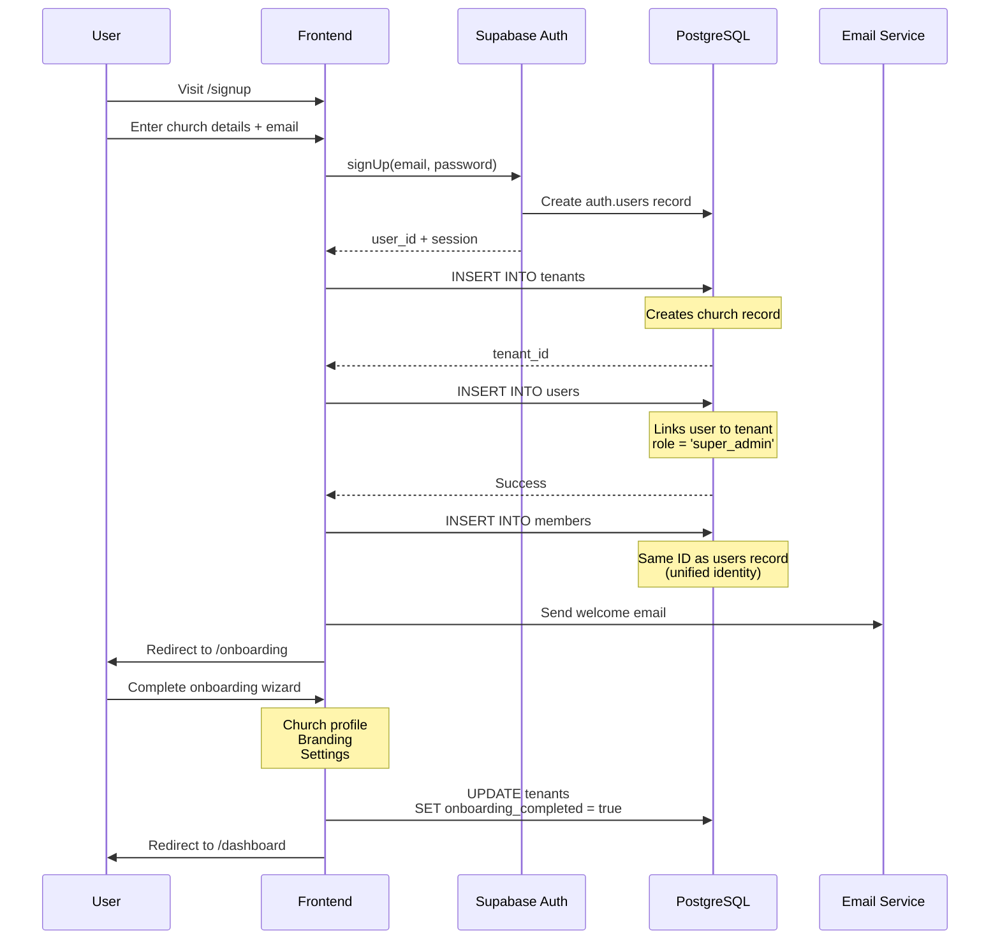

### Key Files
- **Page**: `src/pages/auth/Signup.tsx`
- **Wizard**: `src/pages/Onboarding.tsx`
- **Context**: `src/contexts/ChurchContext.tsx`

### Database Changes
1. Creates `tenants` record
2. Creates `users` record with `role = 'super_admin'`
3. Creates `members` record with same ID (unified identity)
4. Creates default `tenant_subscriptions` record (trial)

## 2. Adding Admin Users (3 Paths)

### Path A: Email Invite (Primary Method)

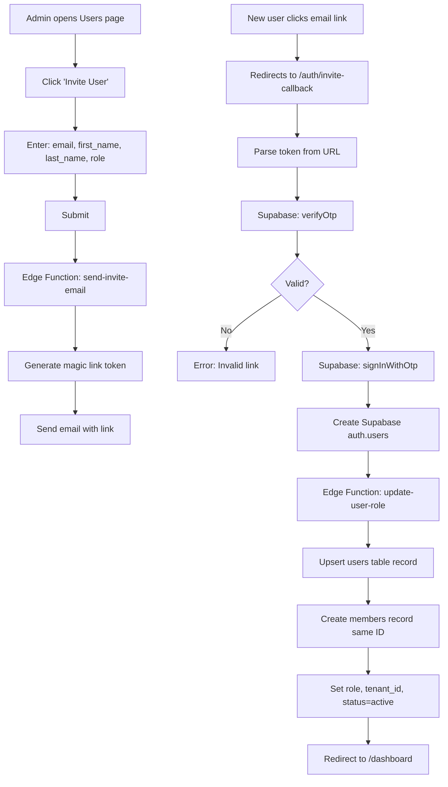

**Key Files**:
- **Admin UI**: `src/pages/settings/Users.tsx` → `UserInviteDialog`
- **Callback**: `src/pages/auth/InviteCallback.tsx`
- **Edge Function**: `supabase/functions/send-invite-email`

**Database Changes**:
1. Supabase Auth creates `auth.users` record
2. `InviteCallback` calls edge function to upsert `users` table
3. Edge function also creates `members` record with same ID
4. Sets `role`, `tenant_id`, `status = 'active'`

### Path B: Direct Add (Manual Creation)

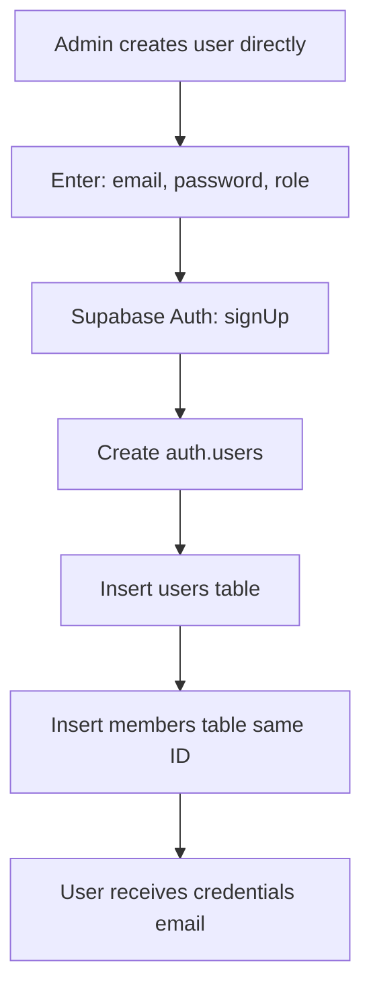

**Used when**: Bulk importing staff or setting up accounts offline

### Path C: Reactivation (Inactive → Active)

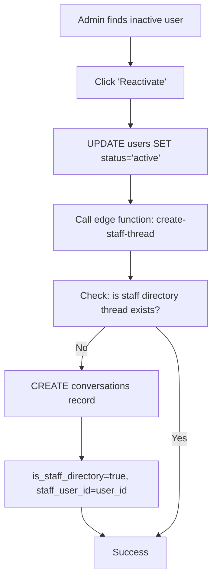

**Key Files**:
- **Admin UI**: `src/pages/settings/Users.tsx`
- **Edge Function**: `supabase/functions/create-staff-thread`
- **Edge Function**: `supabase/functions/update-user-role`

**Database Changes**:
1. `UPDATE users SET status = 'active'`
2. Creates staff directory thread in `conversations` table
3. Allows members to message this staff member

## 3. Adding Members (4 Paths)

### Path A: Admin-Added Member

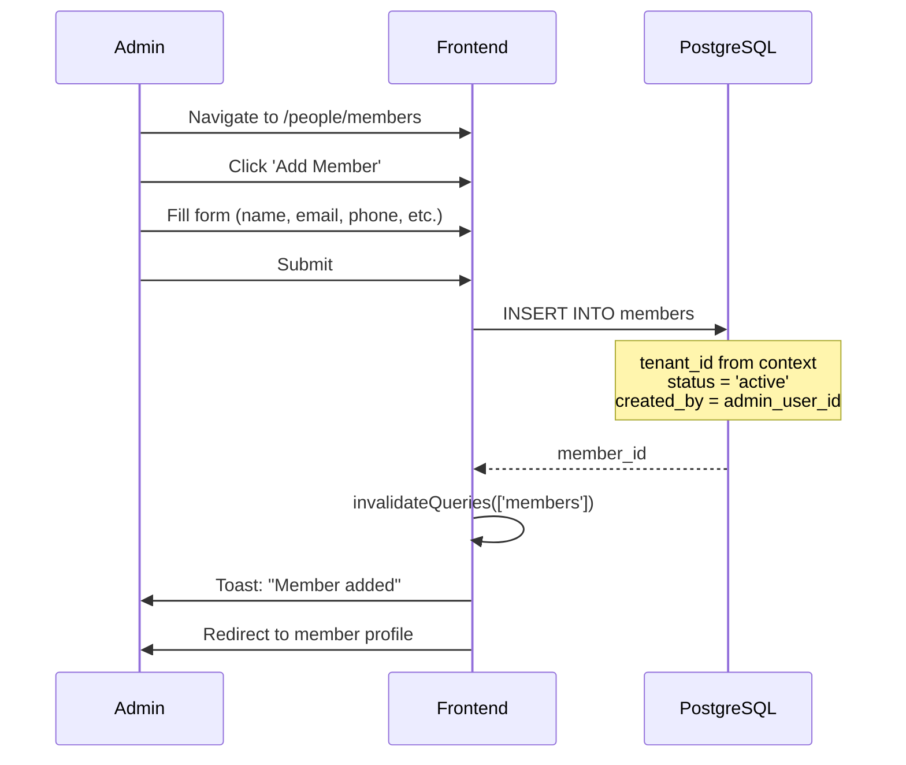

**Key Files**:
- **Page**: `src/pages/people/Members.tsx`
- **Component**: `src/components/members/MemberForm.tsx`
- **Profile**: `src/pages/people/MemberProfile.tsx`

**Database Changes**:
- Single `INSERT INTO members`
- No `users` record created (member cannot log in yet)
- Can later be invited to member portal

### Path B: CSV Import

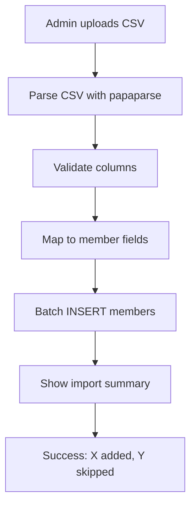

**Key Files**:
- **Component**: `src/components/members/MemberImportDialog.tsx`
- **Library**: `papaparse` for CSV parsing

### Path C: Visitor Conversion

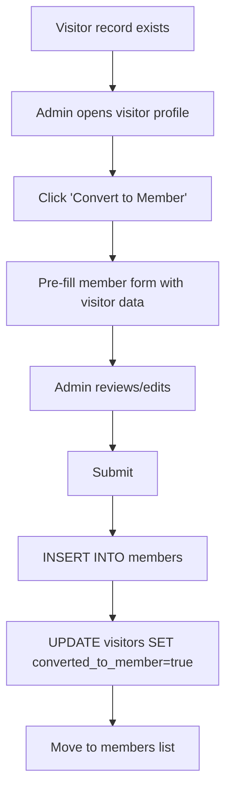

**Key Files**:
- **Page**: `src/pages/people/Visitors.tsx`
- **Component**: Visitor detail view with convert button

**Database Changes**:
1. `INSERT INTO members` (copy data from visitor)
2. `UPDATE visitors SET converted_to_member = true, converted_at = now()`

### Path D: Self-Registration (Member Portal)

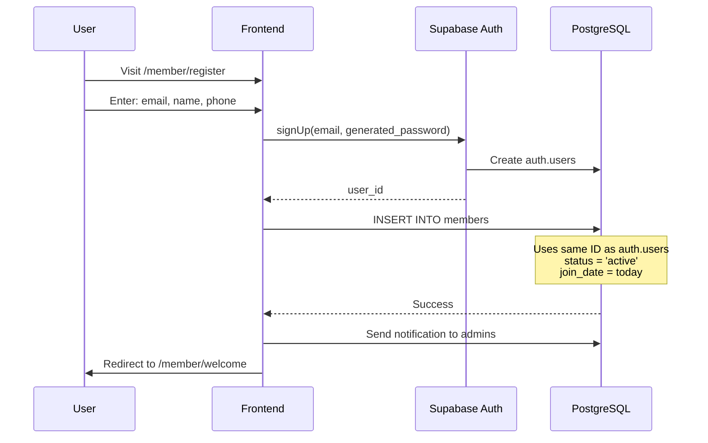

**Key Files**:
- **Page**: `src/pages/MemberRegistration.tsx`
- **Context**: `src/contexts/MemberPortalContext.tsx`

**Database Changes**:
1. `auth.users` record created
2. `members` record with same ID
3. `notifications` sent to church admins

## 4. Visitor Pipeline

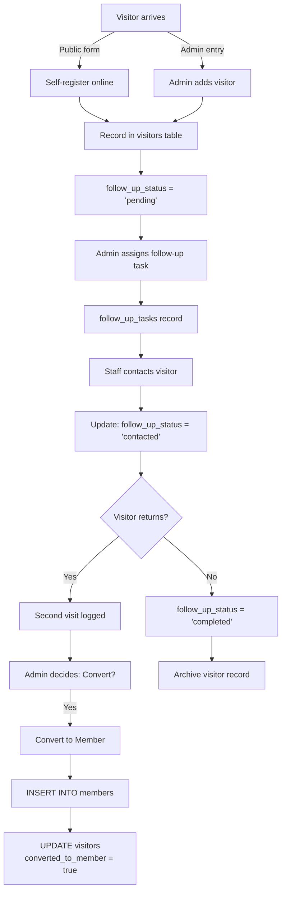

### Visitor Followup Flow

**Key Tables**:
- `visitors` - Basic visitor info
- `visitor_followup_notes` - Communication log
- `follow_up_tasks` - Assigned follow-up actions

**Key Files**:
- **Page**: `src/pages/people/Visitors.tsx`
- **Public Form**: `src/pages/VisitorRegistration.tsx`

### Visitor Status States
- `pending` - New visitor, no contact yet
- `contacted` - Initial contact made
- `scheduled` - Follow-up meeting scheduled
- `completed` - Follow-up done, visitor decision made

## 5. Member Portal Access

Not all members have portal access. Portal access is granted when:

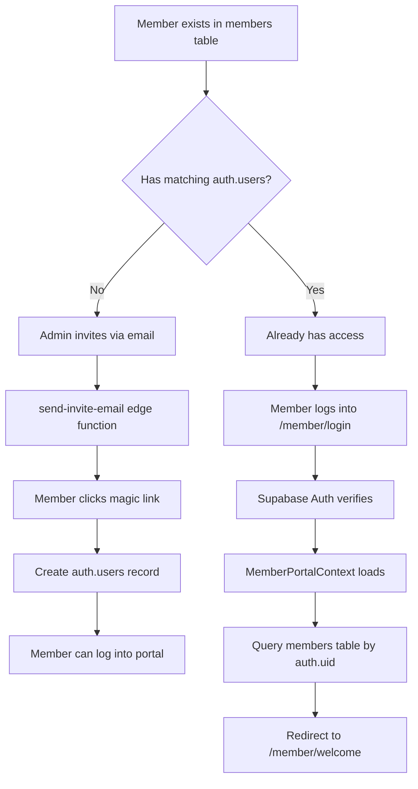

**Key Files**:
- **Login**: `src/pages/member/Login.tsx` (member-specific login)
- **Context**: `src/contexts/MemberPortalContext.tsx`
- **Welcome**: `src/pages/member/MemberWelcome.tsx`

### Member Portal Features
Once logged in, members can:
- View announcements
- Give online
- RSVP to events
- Message staff (direct 1-on-1)
- Access sermon library
- Use Bible study tools
- View/update their profile

## 6. Staff Directory & Messaging

When a user is added/reactivated as staff:

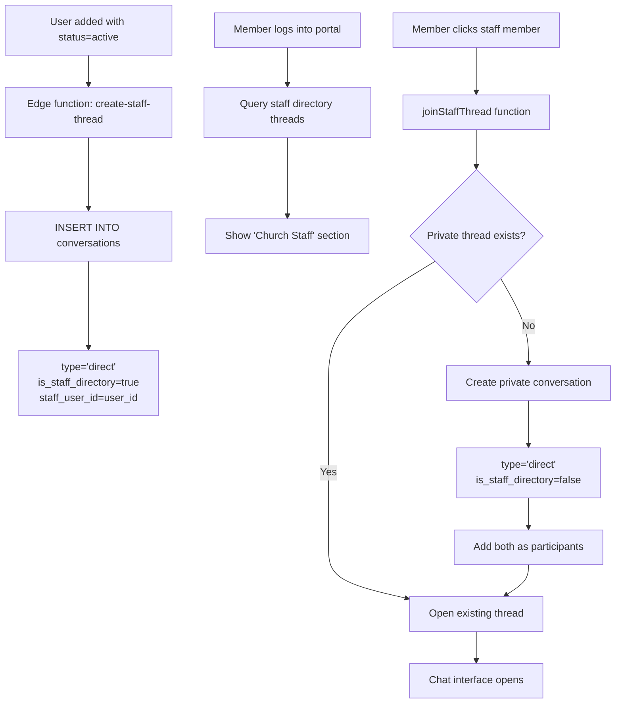

**Key Concepts**:
- **Staff Directory Threads**: Discovery mechanism (is_staff_directory=true)
- **Private Threads**: Actual 1-on-1 conversations (is_staff_directory=false)
- Each member gets their own private thread with each staff member
- Staff directory threads are hidden from admin inbox (staff-to-staff filter)

**Key Files**:
- **Admin Side**: `src/pages/communications/MemberMessaging.tsx`
- **Member Side**: `src/pages/member/MemberMessages.tsx`
- **Edge Function**: `supabase/functions/create-staff-thread`

## 7. Permission Inheritance

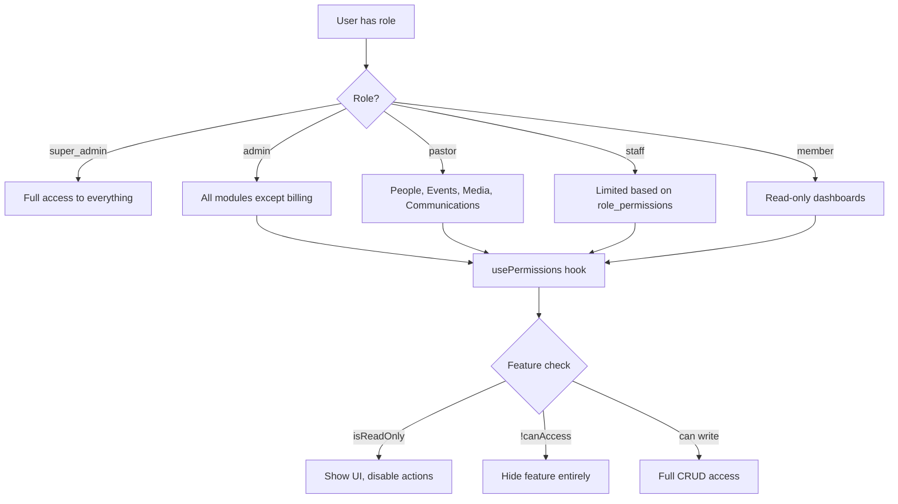

**Permission Check Example**:
```typescript
const { isReadOnly, canAccess } = usePermissions();

// Hide feature if no access
if (!canAccess('finance')) {
  return null;
}

// Show but disable actions
const readOnly = isReadOnly('finance');

<PermissionButton 
  permission="finance"
  onClick={handleDelete}
  readOnly={readOnly}
>
  Delete
</PermissionButton>
```

**Key Files**:
- **Hook**: `src/hooks/usePermissions.ts`
- **Component**: `src/components/shared/PermissionButton.tsx`
- **Context**: `src/contexts/ChurchContext.tsx` (provides role)

---

## Summary of ID Relationships

| Scenario | auth.users | users table | members table |
|----------|------------|-------------|---------------|
| Super Admin (first user) | ✓ | ✓ same ID | ✓ same ID |
| Invited Admin | ✓ | ✓ same ID | ✓ same ID |
| Admin-added Member | ✗ | ✗ | ✓ |
| Member with Portal Access | ✓ | ✗ | ✓ same ID |
| Visitor | ✗ | ✗ | ✗ (visitors table) |

**Key Principle**: When someone has BOTH admin access AND member status, they share the same ID across `auth.users`, `users`, and `members`.

---

**Next**: Read `04-authentication-and-permissions.md` for the complete security model.
