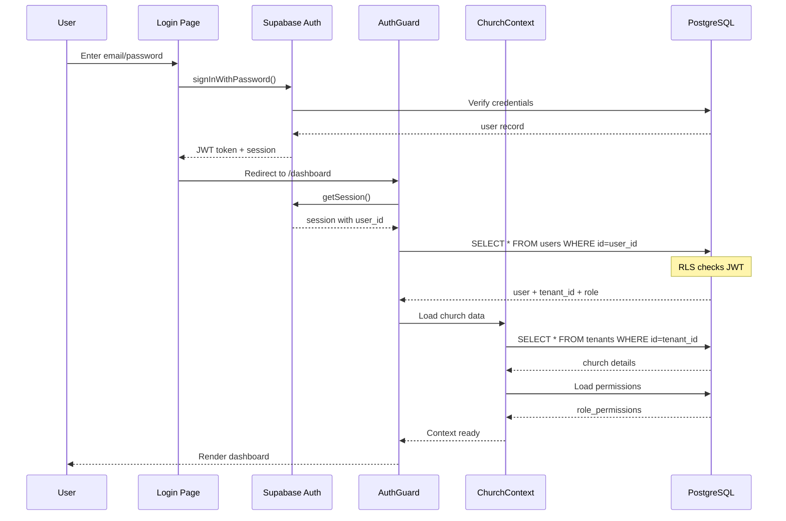
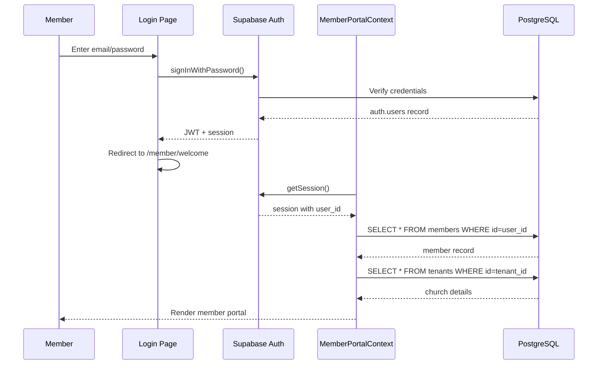
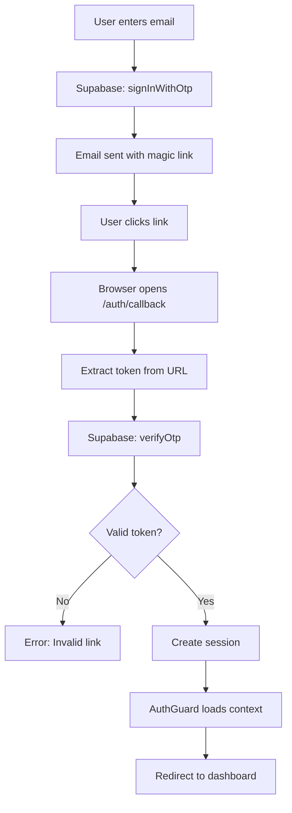
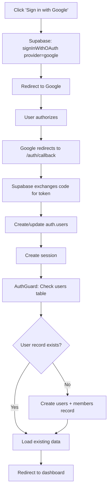
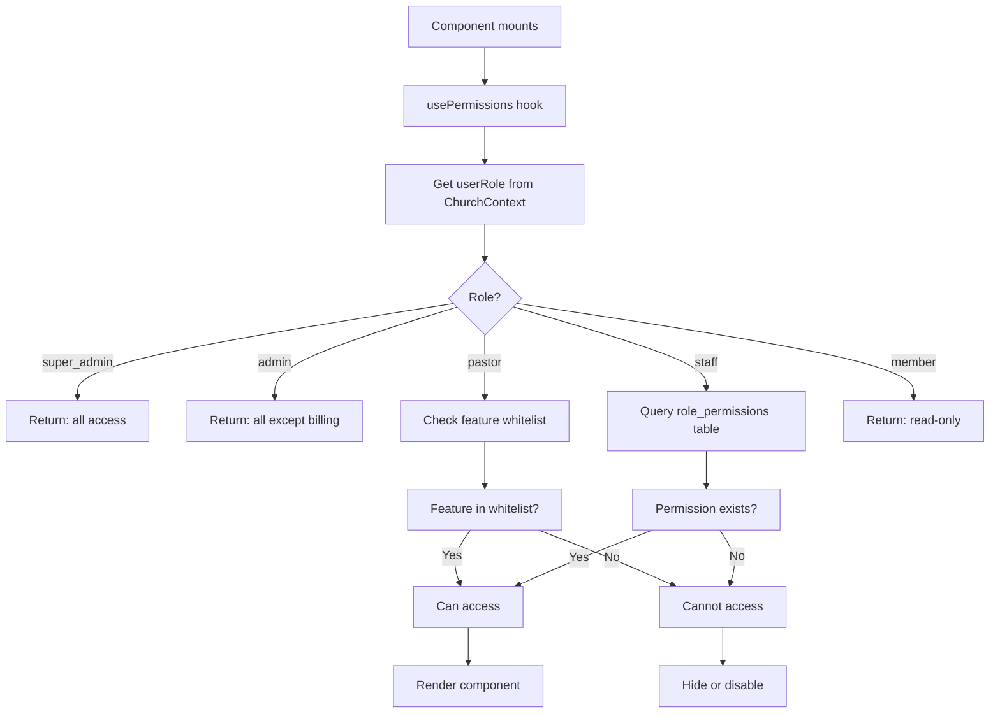
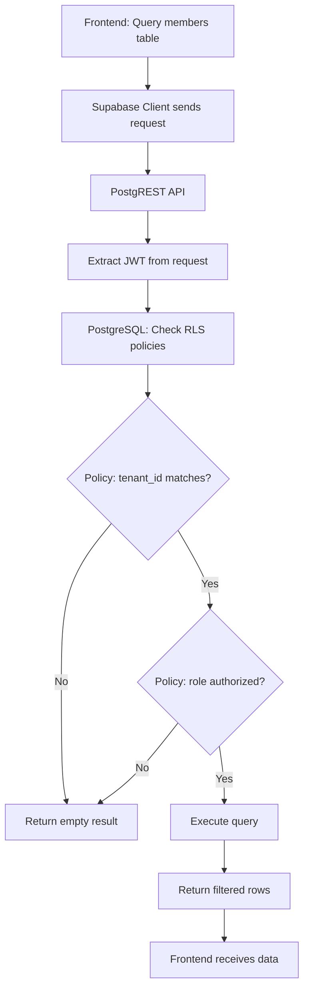
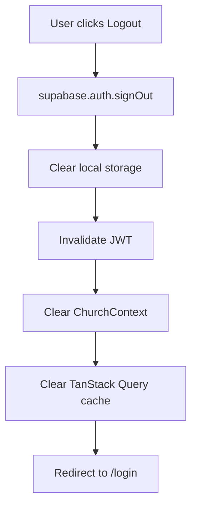

# VestryHub - Authentication & Permissions

## Authentication Flows

### Admin Login Flow



**Key Files**:
- **Page**: `src/pages/auth/Login.tsx`
- **Guard**: `src/components/layout/AuthGuard.tsx`
- **Context**: `src/contexts/ChurchContext.tsx`

### Member Portal Login Flow



**Key Files**:
- **Page**: `src/pages/member/Login.tsx`
- **Context**: `src/contexts/MemberPortalContext.tsx`

### Magic Link Login



**Key Files**:
- **Callback**: `src/pages/auth/AuthCallback.tsx`

### OAuth (Google, etc.)



**Configuration**: Set in Supabase dashboard under Authentication > Providers

## Permission System

### Role Hierarchy

```
super_admin
  ├── Full access to all features
  ├── Can manage billing
  ├── Can delete church
  └── Can promote/demote other admins

admin
  ├── All modules except billing
  ├── Can add/remove users
  ├── Cannot delete church
  └── Cannot change super_admin role

pastor
  ├── People, Events, Media
  ├── Communications
  ├── Reports (read-only)
  └── Cannot access Finance or Settings

staff
  ├── Based on role_permissions table
  ├── Custom per-module access
  └── Can be limited to read-only

member
  ├── Dashboard view only
  ├── Can view reports
  └── No write access
```

### usePermissions Hook

```typescript
// src/hooks/usePermissions.ts
export function usePermissions() {
  const { userRole } = useChurch();
  
  const isReadOnly = (feature: string): boolean => {
    if (userRole === 'super_admin' || userRole === 'admin') return false;
    if (userRole === 'member') return true;
    // Check role_permissions table for staff
    return checkFeaturePermission(feature, 'read_only');
  };
  
  const canAccess = (feature: string): boolean => {
    if (userRole === 'super_admin' || userRole === 'admin') return true;
    if (userRole === 'member') return feature === 'reports';
    // Check role_permissions for staff
    return checkFeaturePermission(feature, 'can_access');
  };
  
  return { isReadOnly, canAccess };
}
```

### Permission Check Flow



### PermissionButton Component

```typescript
// Usage
<PermissionButton
  permission="finance"
  onClick={handleDelete}
  variant="destructive"
>
  Delete Transaction
</PermissionButton>

// Implementation
function PermissionButton({ permission, readOnly, ...props }) {
  const { isReadOnly, canAccess } = usePermissions();
  
  // Hide if no access at all
  if (!canAccess(permission)) {
    return null;
  }
  
  // Show but disable if read-only
  const disabled = readOnly || isReadOnly(permission);
  
  return (
    <Button 
      {...props} 
      disabled={disabled}
      title={disabled ? "You don't have permission to perform this action" : undefined}
    />
  );
}
```

### Feature Permission Gates

Every feature module checks permissions:

```typescript
// Example: Finance page
function FinancePage() {
  const { canAccess, isReadOnly } = usePermissions();
  
  // Hide entire page if no access
  if (!canAccess('finance')) {
    return <Navigate to="/dashboard" />;
  }
  
  const readOnly = isReadOnly('finance');
  
  return (
    <div>
      <PageHeader 
        title="Finance"
        action={
          <PermissionButton 
            permission="finance"
            readOnly={readOnly}
            onClick={handleAdd}
          >
            Add Donation
          </PermissionButton>
        }
      />
      {/* Rest of page */}
    </div>
  );
}
```

## Row Level Security (RLS)

Every table has RLS policies that enforce tenant isolation and permissions.

### Example: members Table

```sql
-- Read: Any authenticated user from same tenant
CREATE POLICY "Users can read their tenant members"
ON members FOR SELECT
USING (
  tenant_id = (
    SELECT tenant_id FROM users WHERE id = auth.uid()
  )
);

-- Write: Only admins and super_admins
CREATE POLICY "Admins can write members"
ON members FOR ALL
USING (
  tenant_id = (SELECT tenant_id FROM users WHERE id = auth.uid())
  AND EXISTS (
    SELECT 1 FROM users
    WHERE id = auth.uid()
    AND role IN ('admin', 'super_admin')
  )
);
```

### Example: giving_records Table

```sql
-- Read: Admins + finance role
CREATE POLICY "Authorized users can read giving"
ON giving_records FOR SELECT
USING (
  tenant_id = (SELECT tenant_id FROM users WHERE id = auth.uid())
  AND EXISTS (
    SELECT 1 FROM users
    WHERE id = auth.uid()
    AND (
      role IN ('admin', 'super_admin')
      OR EXISTS (
        SELECT 1 FROM role_permissions
        WHERE user_id = auth.uid()
        AND feature = 'finance'
        AND can_access = true
      )
    )
  )
);

-- Write: Only admins
CREATE POLICY "Admins can write giving"
ON giving_records FOR INSERT
WITH CHECK (
  tenant_id = (SELECT tenant_id FROM users WHERE id = auth.uid())
  AND EXISTS (
    SELECT 1 FROM users
    WHERE id = auth.uid()
    AND role IN ('admin', 'super_admin')
  )
);
```

### RLS Check Flow



## Session Management

### JWT Claims

Supabase JWT contains:
```json
{
  "sub": "user_id",
  "email": "user@example.com",
  "tenant_id": "church_id",
  "role": "admin",
  "iat": 1234567890,
  "exp": 1234571490
}
```

### Session Refresh

```typescript
// Automatic refresh handled by Supabase client
const { data: { session } } = await supabase.auth.getSession();

// Manual refresh
const { data: { session } } = await supabase.auth.refreshSession();
```

### Logout Flow



## Security Best Practices

### 1. Never Expose Secrets to Frontend
```typescript
// BAD - API key in frontend
const apiKey = 'sk_live_xxxx';

// GOOD - Call edge function
const { data } = await supabase.functions.invoke('send-sms', {
  body: { message, recipient }
});
```

### 2. Always Filter by tenant_id
```typescript
// BAD - No tenant filter
const { data } = await supabase.from('members').select('*');

// GOOD - Tenant filtered
const { data } = await supabase
  .from('members')
  .select('*')
  .eq('tenant_id', tenantId);
```

### 3. Check Permissions Before Mutations
```typescript
// BAD - No permission check
const handleDelete = async () => {
  await supabase.from('members').delete().eq('id', memberId);
};

// GOOD - Check first
const handleDelete = async () => {
  if (isReadOnly('people')) {
    toast.error('You do not have permission');
    return;
  }
  await supabase.from('members').delete().eq('id', memberId);
};
```

### 4. Use Edge Functions for Sensitive Operations
Operations that should use edge functions:
- Sending SMS/emails (API keys required)
- Payment processing (secret keys)
- Role changes (elevated permissions)
- Cross-tenant operations (superadmin only)

---

**Next**: Read `05-edge-functions.md` for server-side operation details.
