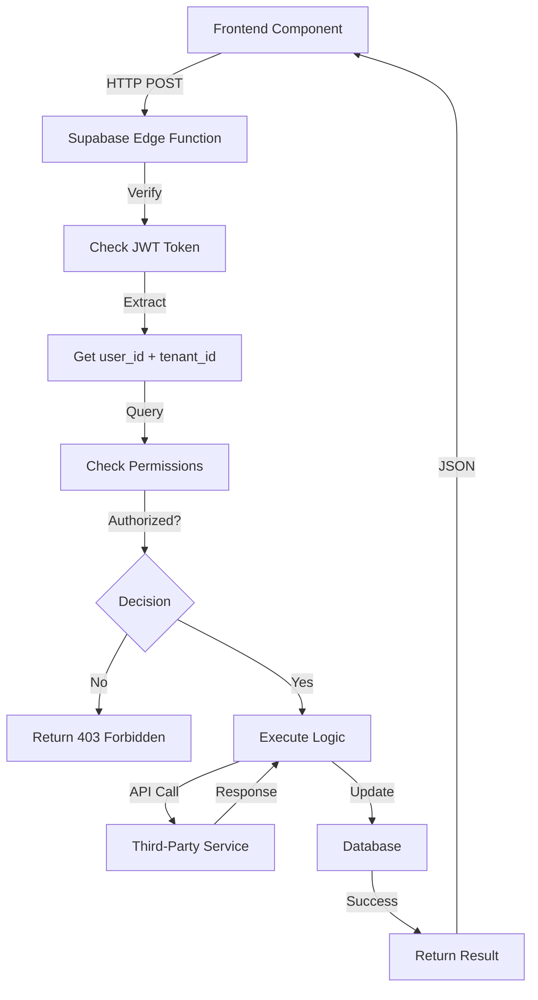

# VestryHub - Edge Functions

Edge Functions are serverless Deno functions that run on Supabase's infrastructure. They handle operations that require:
- Secret API keys (can't expose in frontend)
- Elevated permissions (bypass RLS)
- Third-party API calls
- Complex server-side logic

## All Edge Functions

### 1. africastalking-sms
**Purpose**: Send SMS messages via Africa's Talking API

**Input**:
```typescript
{
  recipients: string[],  // Phone numbers
  message: string,       // SMS content
  tenant_id: string      // Church ID
}
```

**Logic**:
1. Verify JWT token
2. Check tenant SMS credits in `tenant_subscriptions`
3. Call Africa's Talking API with secret key
4. Deduct credits: `UPDATE tenant_subscriptions SET sms_credits = sms_credits - count`
5. Log to `sms_history` table
6. Return success/failure

**Why Edge Function**: Africa's Talking API key must stay secret

**Triggered By**: `src/pages/communications/SmsTab.tsx`

---

### 2. send-email
**Purpose**: Send transactional emails via Resend

**Input**:
```typescript
{
  to: string[],
  subject: string,
  html: string,
  tenant_id: string
}
```

**Logic**:
1. Verify JWT
2. Check email credits
3. Call Resend API
4. Deduct credits
5. Log to activity log

**Why Edge Function**: Resend API key protection

**Triggered By**: Email composer, automated emails

---

### 3. process-email-automations
**Purpose**: Scheduled task to process email automations

**Input**: None (cron trigger)

**Logic**:
1. Query `email_automations` where `next_run_at <= now()`
2. For each automation:
   - Get recipient list based on filters
   - Send emails via Resend
   - Update `last_run_at`, calculate next `next_run_at`
3. Handle errors and retries

**Why Edge Function**: Scheduled background job

**Triggered By**: Supabase cron (daily)

**File**: `supabase/functions/process-email-automations/index.ts`

---

### 4. update-user-role
**Purpose**: Change user roles (requires elevated permissions)

**Input**:
```typescript
{
  user_id: string,
  role: 'admin' | 'pastor' | 'staff' | 'member',
  tenant_id: string
}
```

**Logic**:
1. Verify requester is super_admin
2. `UPDATE users SET role = $1 WHERE id = $2`
3. If activating user, call `create-staff-thread`
4. Return success

**Why Edge Function**: Role changes need admin verification

**Triggered By**: `src/pages/settings/Users.tsx`

**File**: `supabase/functions/update-user-role/index.ts`

---

### 5. create-staff-thread
**Purpose**: Auto-create staff directory conversation

**Input**:
```typescript
{
  staff_user_id: string,
  tenant_id: string
}
```

**Logic**:
1. Check if staff directory thread exists for this user
2. If not, `INSERT INTO conversations`:
   - `type = 'direct'`
   - `is_staff_directory = true`
   - `staff_user_id = user_id`
3. Return conversation_id

**Why Edge Function**: Needs to create records for discovery

**Triggered By**: 
- User invite callback
- User reactivation
- Staff role assignment

**File**: `supabase/functions/create-staff-thread/index.ts`

---

### 6. sync-member-profile
**Purpose**: Sync member profile updates to users table

**Input**:
```typescript
{
  member_id: string,
  first_name: string,
  last_name: string,
  tenant_id: string
}
```

**Logic**:
1. Verify member owns this record OR is admin
2. `UPDATE users SET first_name = $1, last_name = $2 WHERE id = member_id`
3. Return success

**Why Edge Function**: Updates across tables need transaction safety

**Triggered By**: `src/pages/people/MemberProfile.tsx` when editing own profile

**File**: `supabase/functions/sync-member-profile/index.ts`

---

### 7. payhero-callback
**Purpose**: Handle PayHero payment webhooks

**Input**: PayHero webhook payload
```typescript
{
  transaction_id: string,
  amount: number,
  phone: string,
  status: 'success' | 'failed',
  // ... other PayHero fields
}
```

**Logic**:
1. Verify webhook signature
2. Find matching giving record by transaction_id
3. `UPDATE giving_records SET status = $1`
4. Send notification to donor
5. Return 200 OK

**Why Edge Function**: Webhook receiver, no frontend involved

**Triggered By**: PayHero payment gateway

---

### 8. payhero-till-setup
**Purpose**: Initialize PayHero M-Pesa till for church

**Input**:
```typescript
{
  tenant_id: string,
  paybill_number: string,
  account_number: string
}
```

**Logic**:
1. Call PayHero API to register till
2. Store credentials in `integration_settings`
3. Return success + till_id

**Why Edge Function**: PayHero API secret

**Triggered By**: `src/pages/settings/Integrations.tsx`

---

### 9. ai-tools-proxy
**Purpose**: Proxy AI API calls to protect API keys

**Input**:
```typescript
{
  model: 'gpt-4' | 'gpt-3.5-turbo',
  messages: Array<{role: string, content: string}>,
  tenant_id: string
}
```

**Logic**:
1. Verify JWT
2. Check AI credits in subscription
3. Call OpenAI API with secret key
4. Log usage to `ai_tool_usage`
5. Deduct credits
6. Return AI response

**Why Edge Function**: OpenAI API key protection

**Triggered By**: AI-powered features (sermon generator, etc.)

---

## Edge Function Architecture



## Common Patterns

### 1. JWT Verification
```typescript
export async function verifyAuth(req: Request) {
  const authHeader = req.headers.get('Authorization');
  if (!authHeader) throw new Error('No auth header');
  
  const token = authHeader.replace('Bearer ', '');
  const { data: { user }, error } = await supabase.auth.getUser(token);
  
  if (error || !user) throw new Error('Invalid token');
  return user;
}
```

### 2. Tenant Verification
```typescript
async function verifyTenant(userId: string, tenantId: string) {
  const { data } = await supabase
    .from('users')
    .select('tenant_id')
    .eq('id', userId)
    .single();
    
  if (data.tenant_id !== tenantId) {
    throw new Error('Tenant mismatch');
  }
}
```

### 3. Credit Deduction
```typescript
async function deductCredits(tenantId: string, creditType: string, amount: number) {
  const { error } = await supabase.rpc('deduct_credits', {
    p_tenant_id: tenantId,
    p_credit_type: creditType,
    p_amount: amount
  });
  
  if (error) throw new Error('Insufficient credits');
}
```

### 4. Error Handling
```typescript
export default async function handler(req: Request) {
  try {
    const user = await verifyAuth(req);
    const { tenant_id } = await req.json();
    await verifyTenant(user.id, tenant_id);
    
    // ... function logic
    
    return new Response(JSON.stringify({ success: true }), {
      headers: { 'Content-Type': 'application/json' }
    });
  } catch (error) {
    return new Response(JSON.stringify({ error: error.message }), {
      status: 400,
      headers: { 'Content-Type': 'application/json' }
    });
  }
}
```

## Deployment

Edge functions are deployed via Supabase CLI:

```bash
# Deploy single function
supabase functions deploy africastalking-sms

# Deploy all functions
supabase functions deploy

# Set secrets
supabase secrets set AFRICASTALKING_API_KEY=xxx
supabase secrets set OPENAI_API_KEY=xxx
supabase secrets set RESEND_API_KEY=xxx
```

## Environment Variables (Secrets)

Set in Supabase dashboard or CLI:

```bash
AFRICASTALKING_API_KEY=xxx
AFRICASTALKING_USERNAME=xxx
RESEND_API_KEY=xxx
OPENAI_API_KEY=xxx
PAYHERO_API_KEY=xxx
PAYHERO_API_SECRET=xxx
CANVA_CLIENT_SECRET=xxx
```

## Monitoring

- **Logs**: View in Supabase dashboard > Edge Functions > Logs
- **Errors**: Tracked via Sentry (if configured)
- **Metrics**: Supabase provides invocation count, duration, errors

---

**Next**: Read `06-messaging-system.md` for the communications architecture.
