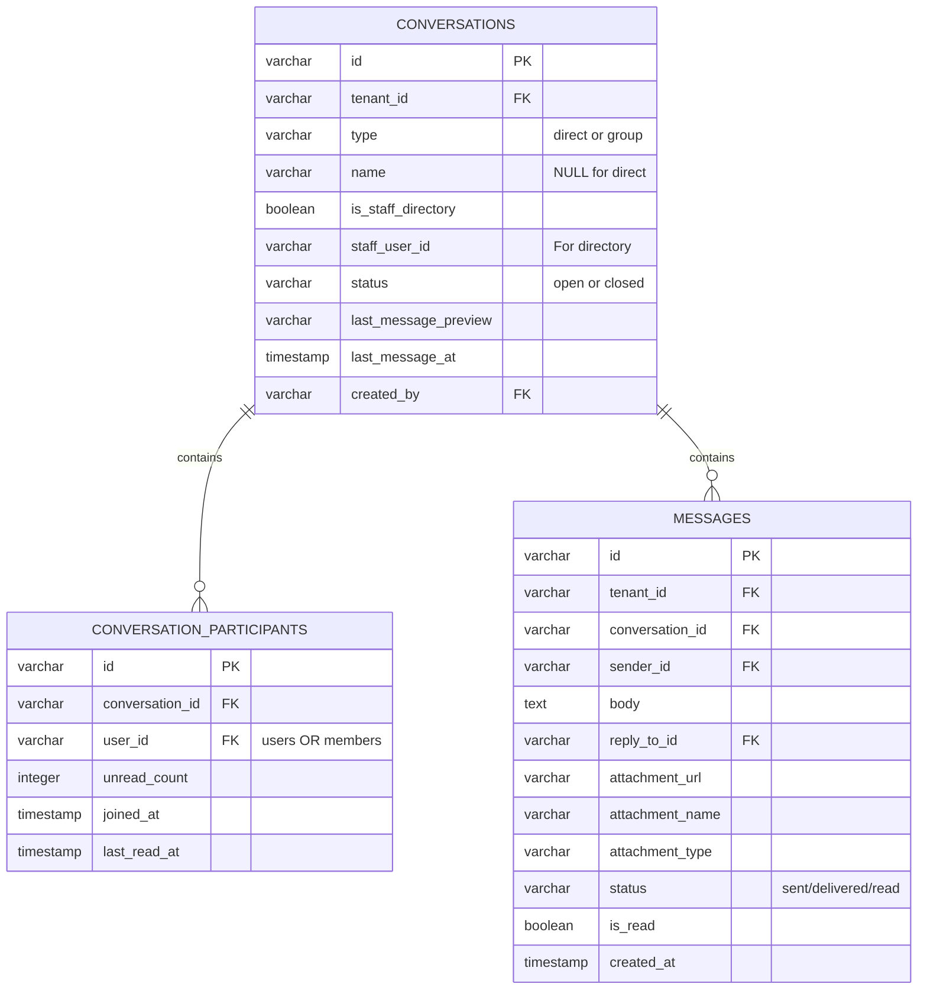
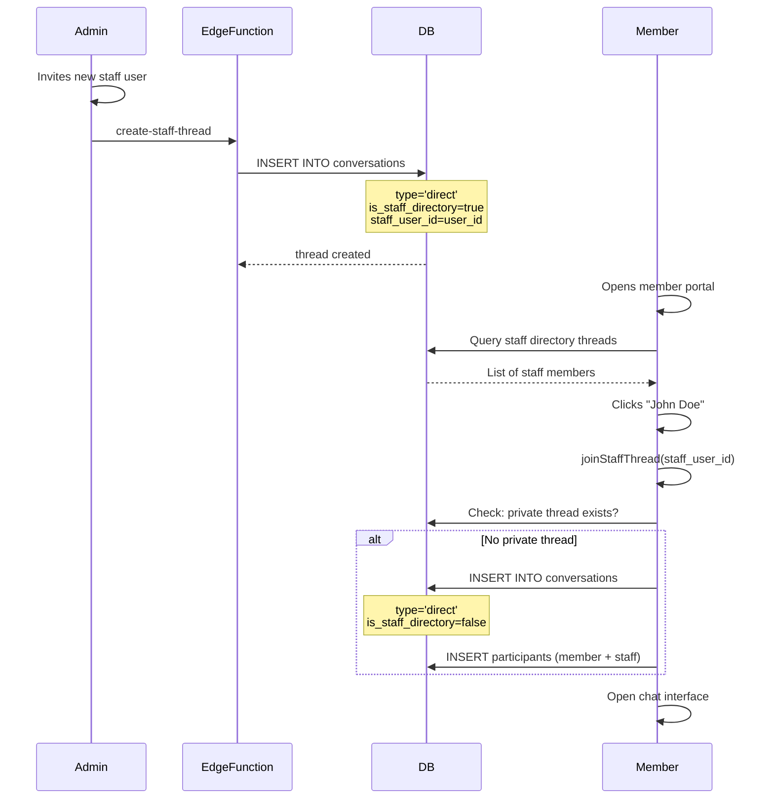
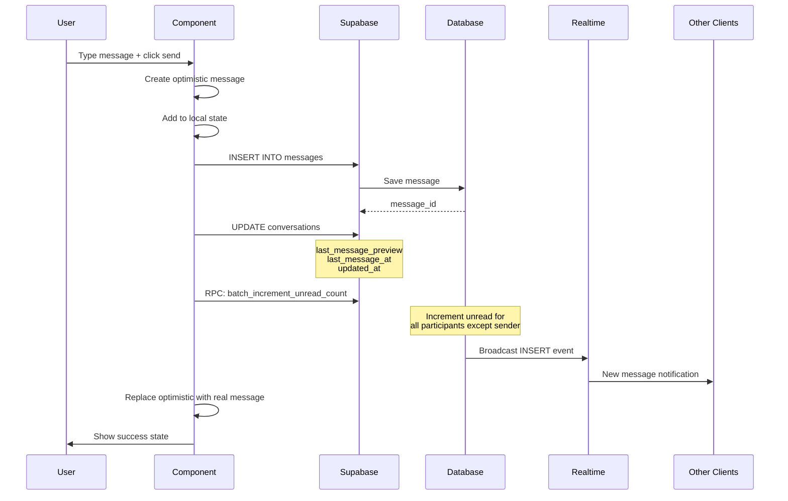

# VestryHub - Messaging System

## Overview

The messaging system enables:
- **Admin-to-Member**: Staff can message members directly
- **Member-to-Staff**: Members can message any staff member
- **Group Chats**: Multi-person conversations
- **Staff Directory**: Discovery mechanism for member-staff communication

## Architecture

### Three-Table Design



## Staff Directory System

### Discovery vs Private Threads

**Staff Directory Thread** (Discovery)
- `is_staff_directory = true`
- `staff_user_id = <staff_member_id>`
- Shown in member portal "CHURCH STAFF" section
- NOT an actual chat - just a discovery mechanism
- Hidden from admin inbox (staff-to-staff filter)

**Private Thread** (Actual Chat)
- `is_staff_directory = false`
- `type = 'direct'`
- Created when member clicks staff member
- Each member gets their OWN private thread with each staff member
- Shows in both admin and member inboxes

### Staff Directory Flow



### joinStaffThread Logic

**File**: `src/pages/member/MemberMessages.tsx`

```typescript
const joinStaffThread = async (staffUserId: string) => {
  // Prevent double-clicks
  if (joiningStaffId === staffUserId) return;
  setJoiningStaffId(staffUserId);
  
  try {
    // Check if private bilateral thread exists
    const { data: myConvs } = await supabase
      .from('conversation_participants')
      .select('conversation_id')
      .eq('user_id', member.memberId);
    
    const myConvIds = myConvs.map(r => r.conversation_id);
    
    // Find shared conversation with staff
    let privateConvId = null;
    if (myConvIds.length > 0) {
      const { data: staffConvs } = await supabase
        .from('conversation_participants')
        .select('conversation_id')
        .eq('user_id', staffUserId)
        .in('conversation_id', myConvIds);
        
      for (const row of staffConvs) {
        const { data: conv } = await supabase
          .from('conversations')
          .select('id, type, is_staff_directory')
          .eq('id', row.conversation_id)
          .eq('type', 'direct')
          .eq('is_staff_directory', false)
          .maybeSingle();
          
        if (conv) {
          privateConvId = conv.id;
          break;
        }
      }
    }
    
    // Create private thread if doesn't exist
    if (!privateConvId) {
      const { data: newConv } = await supabase
        .from('conversations')
        .insert({
          tenant_id: member.tenantId,
          type: 'direct',
          is_staff_directory: false,
          created_by: member.memberId,
          status: 'open'
        })
        .select('id')
        .single();
        
      privateConvId = newConv.id;
      
      // Add both participants
      await supabase.from('conversation_participants').insert([
        { conversation_id: privateConvId, user_id: member.memberId, unread_count: 0 },
        { conversation_id: privateConvId, user_id: staffUserId, unread_count: 0 }
      ]);
    }
    
    // Open the chat
    selectConversation(privateConvId);
  } finally {
    setJoiningStaffId(null);
  }
};
```

## Admin Messaging

**File**: `src/pages/communications/MemberMessaging.tsx`

### Conversation List Filtering

**Direct Messages Tab**:
```typescript
const { data: conversations } = useQuery({
  queryKey: ['conversations-dm', tenantId],
  queryFn: async () => {
    // Get conversations where admin is participant
    const { data: participantRows } = await supabase
      .from('conversation_participants')
      .select('conversation_id')
      .eq('user_id', userId);
      
    const myConvIds = participantRows.map(r => r.conversation_id);
    
    // Fetch conversations
    const { data } = await supabase
      .from('conversations')
      .select('*, conversation_participants(user_id, unread_count)')
      .in('id', myConvIds)
      .eq('tenant_id', tenantId)
      .eq('type', 'direct')
      .order('last_message_at', { ascending: false });
      
    const convList = data || [];
    
    // FILTER OUT STAFF-TO-STAFF CONVERSATIONS
    const otherUserIds = convList
      .map(conv => conv.conversation_participants
        .find(p => p.user_id !== userId)?.user_id)
      .filter(Boolean);
      
    // Check which other participants are staff
    const { data: otherAsStaff } = await supabase
      .from('users')
      .select('id')
      .in('id', otherUserIds)
      .eq('status', 'active');
      
    const staffIds = new Set(otherAsStaff.map(u => u.id));
    
    // Filter out conversations where other participant is staff
    return convList.filter(conv => {
      const otherId = conv.conversation_participants
        .find(p => p.user_id !== userId)?.user_id;
      return !otherId || !staffIds.has(otherId);
    });
  }
});
```

This ensures:
- Admins only see conversations with actual members
- Staff-to-staff private threads are hidden
- Only member communication shows in inbox

## Member Portal Messaging

**File**: `src/pages/member/MemberMessages.tsx`

### Conversation List Filtering

```typescript
const { data: conversations } = useQuery({
  queryKey: ['member-conversations', member.memberId],
  queryFn: async () => {
    // Get conversations where member is participant
    const { data: participantRows } = await supabase
      .from('conversation_participants')
      .select('conversation_id')
      .eq('user_id', member.memberId);
      
    const convIds = participantRows.map(r => r.conversation_id);
    
    // Fetch conversations (exclude staff directory discovery threads)
    const { data } = await supabase
      .from('conversations')
      .select('*, conversation_participants(user_id, unread_count)')
      .in('id', convIds)
      .eq('is_staff_directory', false)  // Hide discovery threads
      .order('updated_at', { ascending: false });
      
    // FILTER OUT DUPLICATES (staff conversations)
    const staffUserIds = new Set(
      staffThreads.map(st => st.staff_user_id).filter(Boolean)
    );
    
    return data.filter(conv => {
      const otherId = conv.conversation_participants
        .find(p => p.user_id !== member.memberId)?.user_id;
      return !(otherId && staffUserIds.has(otherId));
    });
  }
});
```

This ensures:
- Members don't see duplicate staff conversations
- Staff directory threads (discovery) are hidden from regular list
- Only actual private threads and group chats show

## Sending Messages

### Message Send Flow



### Send Message Code

```typescript
const sendMsgMutation = useMutation({
  mutationFn: async (body: string) => {
    // Insert message
    const { data, error } = await supabase
      .from('messages')
      .insert({
        tenant_id: tenantId,
        conversation_id: selectedConvId,
        sender_id: userId,
        body,
        status: 'sent',
        ...(replyTo ? { reply_to_id: replyTo.id } : {})
      })
      .select()
      .single();
      
    if (error) throw error;
    
    // Update conversation preview
    await supabase
      .from('conversations')
      .update({
        updated_at: new Date().toISOString(),
        last_message_preview: body.slice(0, 100)
      })
      .eq('id', selectedConvId);
      
    // Increment unread counts for other participants
    await supabase.rpc('batch_increment_unread_count', {
      p_conversation_id: selectedConvId,
      p_excluding_user_id: userId
    });
    
    return data;
  },
  onMutate: async (body) => {
    // Optimistic update
    const optimistic = {
      id: `temp-${Date.now()}`,
      body,
      sender_id: userId,
      created_at: new Date().toISOString(),
      status: 'sending'
    };
    setAllMessages(prev => [...prev, optimistic]);
  },
  onSuccess: () => {
    qc.invalidateQueries({ queryKey: ['conversations-dm', tenantId] });
    setInput('');
    setReplyTo(null);
  }
});
```

## Realtime Updates

### Subscription Setup

```typescript
useEffect(() => {
  if (!selectedConvId) return;
  
  const channel = supabase
    .channel(`chat:${selectedConvId}`)
    // New messages
    .on('postgres_changes', {
      event: 'INSERT',
      schema: 'public',
      table: 'messages',
      filter: `conversation_id=eq.${selectedConvId}`
    }, (payload) => {
      const newMsg = payload.new;
      setAllMessages(prev => {
        if (prev.find(m => m.id === newMsg.id)) return prev;
        return [...prev, newMsg];
      });
      markAsRead(selectedConvId);
    })
    // Typing indicators
    .on('broadcast', { event: 'typing' }, ({ payload }) => {
      if (payload.userId !== userId) {
        setTypingUser(payload.name);
        setTimeout(() => setTypingUser(null), 2000);
      }
    })
    .subscribe();
    
  return () => {
    supabase.removeChannel(channel);
  };
}, [selectedConvId]);
```

### Typing Indicator

```typescript
const sendTyping = useCallback(() => {
  if (channelRef.current) {
    channelRef.current.send({
      type: 'broadcast',
      event: 'typing',
      payload: { userId, name: userName }
    });
  }
}, [userId, userName]);

// Debounced on input change
const handleInputChange = (e) => {
  setInput(e.target.value);
  if (!typingTimeout.current) {
    sendTyping();
    typingTimeout.current = setTimeout(() => {
      typingTimeout.current = null;
    }, 3000);
  }
};
```

## Unread Count Management

### Mark as Read

```typescript
const markAsRead = async (convId: string) => {
  // Reset unread count
  await supabase
    .from('conversation_participants')
    .update({ unread_count: 0 })
    .eq('conversation_id', convId)
    .eq('user_id', userId);
    
  // Mark messages as read
  await supabase
    .from('messages')
    .update({ is_read: true })
    .eq('conversation_id', convId)
    .eq('is_read', false)
    .neq('sender_id', userId);
    
  qc.invalidateQueries({ queryKey: ['conversations-dm', tenantId] });
};
```

### Batch Increment RPC

**SQL Function**:
```sql
CREATE OR REPLACE FUNCTION batch_increment_unread_count(
  p_conversation_id VARCHAR,
  p_excluding_user_id VARCHAR
)
RETURNS VOID AS $$
BEGIN
  UPDATE conversation_participants
  SET unread_count = unread_count + 1
  WHERE conversation_id = p_conversation_id
  AND user_id != p_excluding_user_id;
END;
$$ LANGUAGE plpgsql;
```

## Group Chats

### Creating a Group

```typescript
const createGroup = async (name: string, memberIds: string[]) => {
  // Create conversation
  const { data: conv } = await supabase
    .from('conversations')
    .insert({
      tenant_id: tenantId,
      type: 'group',
      name,
      created_by: userId,
      status: 'open'
    })
    .select('id')
    .single();
    
  // Add participants (creator + selected members)
  const participants = [userId, ...memberIds].map(uid => ({
    conversation_id: conv.id,
    user_id: uid,
    unread_count: 0,
    joined_at: new Date().toISOString()
  }));
  
  await supabase
    .from('conversation_participants')
    .insert(participants);
    
  return conv.id;
};
```

### Group Message Display

- Each message shows sender name (not grouped by sender)
- Avatar shows for each message
- Online indicators for active participants

---

**Next**: Read `07-feature-modules.md` for module-by-module breakdown.
